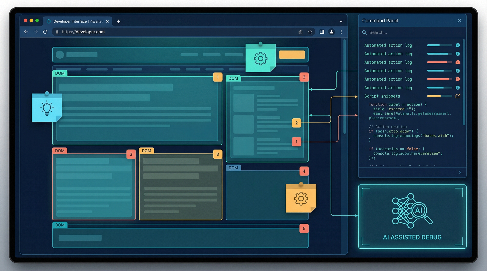

# OpenDevBrowser

[](https://registry.npmjs.org/opendevbrowser)
[](https://opensource.org/licenses/MIT)
[](https://www.typescriptlang.org/)
[](https://opencode.ai)
[](https://registry.npmjs.org/opendevbrowser)

> **Script-first browser automation for AI agents.** Snapshot → Refs → Actions.

OpenDevBrowser is an [OpenCode](https://opencode.ai) plugin that gives AI agents direct browser control via Chrome DevTools Protocol. Launch browsers, capture page snapshots, and interact with elements using stable refs.

<p align="center">
  
  <br />
  <em>AI-assisted annotation and browser automation workflow</em>
</p>

## Why OpenDevBrowser?

| Feature | Benefit |
|---------|---------|
| **Script-first UX** | Snapshot → Refs → Actions workflow optimized for AI agents |
| **Accessibility-tree snapshots** | Token-efficient page representation (not raw DOM) |
| **Stable refs** | Elements identified by `backendNodeId`, not fragile selectors |
| **Security by default** | CDP localhost-only, timing-safe auth, HTML sanitization |
| **3 browser modes** | Managed, CDP connect, or extension relay for logged-in sessions |
| **Relay Hub (FIFO leases)** | Single-owner CDP binding with a FIFO queue for multi-client safety |
| **Flat-session routing** | Extension relay uses DebuggerSession sessionId routing (Chrome 125+) |
| **5 bundled skill packs** | Best practices for login, forms, data extraction |
| **41 tools** | Complete browser automation coverage |
| **97% test coverage** | Production-ready with strict TypeScript |

---

## Installation

### For Humans

```bash
# Interactive installer (recommended)
npx opendevbrowser

# Or specify location
npx opendevbrowser --global   # ~/.config/opencode/opencode.json
npx opendevbrowser --local    # ./opencode.json

# Full install (config + extension assets)
npx opendevbrowser --full
```

Restart OpenCode after installation.

On first successful install, the CLI attempts to install daemon auto-start on supported platforms so the relay is available on login.
You can remove it later with `npx opendevbrowser daemon uninstall`.

OpenCode discovers skills in `.opencode/skill` (project) and `~/.config/opencode/skill` (global) first; `.claude/skills` is compatibility-only. The CLI installs bundled skills into the OpenCode-native locations by default.

### Agent Installation (OpenCode)

Recommended (CLI, installs plugin + config + bundled skills + extension assets):

```bash
npx opendevbrowser --full --global --no-prompt
```

Explicit flags (config + skills, no prompt):

```bash
npx opendevbrowser --global --with-config --skills-global --no-prompt
```

Manual fallback (edit OpenCode config):

```json
{
  "$schema": "https://opencode.ai/config.json",
  "plugin": ["opendevbrowser"]
}
```

Config location: `~/.config/opencode/opencode.json`

Restart OpenCode, then run `opendevbrowser_status` to verify the plugin is loaded (daemon status when hub is enabled).

---

## Quick Start

```
1. Launch a browser session
2. Navigate to a URL
3. Take a snapshot to get element refs
4. Interact using refs (click, type, select)
5. Re-snapshot after navigation
```

### Core Workflow

| Step | Tool | Purpose |
|------|------|---------|
| 1 | `opendevbrowser_launch` | Launch a session (extension relay first; managed fallback is explicit) |
| 2 | `opendevbrowser_goto` | Navigate to URL |
| 3 | `opendevbrowser_snapshot` | Get page structure with refs |
| 4 | `opendevbrowser_click` / `opendevbrowser_type` | Interact with elements |
| 5 | `opendevbrowser_disconnect` | Clean up session |

---

### CLI Automation Quick Start

Run a local daemon for persistent sessions, then drive automation via CLI commands:

```bash
# Start daemon
npx opendevbrowser serve

# Install auto-start (recommended for resilience)
npx opendevbrowser daemon install

# Stop/kill the daemon before restarting
npx opendevbrowser serve --stop

# Launch a session
npx opendevbrowser launch --start-url https://example.com

# Capture a snapshot
npx opendevbrowser snapshot --session-id <session-id>

# Interact by ref
npx opendevbrowser click --session-id <session-id> --ref r12
```

For single-shot scripts:

```bash
npx opendevbrowser run --script ./script.json --output-format json
```

Use `--output-format json|stream-json` for automation-friendly output.

---

## Recent Features

### v0.0.14 (Latest)

- **Extension Mode Remediation** - Improved extension-only workflow with better error handling and recovery. See [Extension Guide](docs/EXTENSION.md) for details.
- **Daemon Auto-Install** - The hub daemon now automatically installs on first use, simplifying setup for new users.
- **Ops Coverage** - Comprehensive E2E testing for daemon and relay operations, ensuring reliability across all modes.
- **CLI Native Status** - Enhanced native host integration with better status reporting and debugging.
- **Security Hardening** - Improved relay authentication, rate limiting, and extension security.

See [CHANGELOG.md](CHANGELOG.md) for complete version history.

## Features

### Browser Control
- **Launch & Connect** - Start managed Chrome or connect to existing browsers
- **Multi-Tab Support** - Create, switch, and manage browser tabs
- **Profile Persistence** - Maintain login sessions across runs
- **Headless Mode** - Run without visible browser window

### Page Interaction
- **Snapshot** - Accessibility-tree based page capture (token-efficient)
- **Click** - Click elements by ref
- **Type** - Enter text into inputs
- **Select** - Choose dropdown options
- **Scroll** - Scroll page or elements
- **Wait** - Wait for selectors or navigation

### DevTools Integration
- **Console Capture** - Monitor console.log, errors, warnings
- **Network Tracking** - Request/response metadata (method, url, status)
- **Screenshot** - Viewport PNG screenshot (file or base64)
- **Performance** - Page load metrics

### Export & Clone
- **DOM Capture** - Extract sanitized HTML with inline styles
- **React Emitter** - Generate React component code from pages
- **CSS Extraction** - Pull computed styles

---

## Tool Reference

OpenDevBrowser provides **41 tools** organized by category:

### Session Management
| Tool | Description |
|------|-------------|
| `opendevbrowser_launch` | Launch a session (extension relay first; managed is explicit) |
| `opendevbrowser_connect` | Connect to existing Chrome CDP endpoint (or relay `/ops`; legacy `/cdp` via `--extension-legacy`) |
| `opendevbrowser_disconnect` | Disconnect browser session |
| `opendevbrowser_status` | Get session status and connection info (daemon status in hub mode) |

### Tab/Target Management
| Tool | Description |
|------|-------------|
| `opendevbrowser_targets_list` | List all browser tabs/targets |
| `opendevbrowser_target_use` | Switch to a specific tab by targetId |
| `opendevbrowser_target_new` | Open new tab (optionally with URL) |
| `opendevbrowser_target_close` | Close a tab by targetId |

### Named Pages
| Tool | Description |
|------|-------------|
| `opendevbrowser_page` | Open or focus a named page (logical tab alias) |
| `opendevbrowser_list` | List all named pages in session |
| `opendevbrowser_close` | Close a named page |

### Navigation & Interaction
| Tool | Description |
|------|-------------|
| `opendevbrowser_goto` | Navigate to URL |
| `opendevbrowser_wait` | Wait for load state or element |
| `opendevbrowser_snapshot` | Capture page accessibility tree with refs |
| `opendevbrowser_click` | Click element by ref |
| `opendevbrowser_hover` | Hover element by ref |
| `opendevbrowser_press` | Press a keyboard key (optionally focusing a ref) |
| `opendevbrowser_check` | Check checkbox/toggle by ref |
| `opendevbrowser_uncheck` | Uncheck checkbox/toggle by ref |
| `opendevbrowser_type` | Type text into input by ref |
| `opendevbrowser_select` | Select dropdown option by ref |
| `opendevbrowser_scroll` | Scroll page or element |
| `opendevbrowser_scroll_into_view` | Scroll element into view by ref |
| `opendevbrowser_run` | Execute multiple actions in sequence |

### DOM Inspection
| Tool | Description |
|------|-------------|
| `opendevbrowser_dom_get_html` | Get outerHTML of element by ref |
| `opendevbrowser_dom_get_text` | Get innerText of element by ref |
| `opendevbrowser_get_attr` | Get attribute value by ref |
| `opendevbrowser_get_value` | Get input value by ref |
| `opendevbrowser_is_visible` | Check if element is visible |
| `opendevbrowser_is_enabled` | Check if element is enabled |
| `opendevbrowser_is_checked` | Check if element is checked |

### DevTools & Analysis
| Tool | Description |
|------|-------------|
| `opendevbrowser_console_poll` | Poll console logs since sequence |
| `opendevbrowser_network_poll` | Poll network requests since sequence |
| `opendevbrowser_screenshot` | Capture page screenshot |
| `opendevbrowser_perf` | Get page performance metrics |
| `opendevbrowser_prompting_guide` | Get best-practice prompting guidance |

### Annotation
| Tool | Description |
|------|-------------|
| `opendevbrowser_annotate` | Capture interactive annotations via extension relay |

### Export & Cloning
| Tool | Description |
|------|-------------|
| `opendevbrowser_clone_page` | Export page as React component + CSS |
| `opendevbrowser_clone_component` | Export element subtree as React component |

### Skills
| Tool | Description |
|------|-------------|
| `opendevbrowser_skill_list` | List available skills |
| `opendevbrowser_skill_load` | Load a skill by name (with optional topic filter) |

---

## Bundled Skills

OpenDevBrowser includes **5 task-specific skill packs**:

| Skill | Purpose |
|-------|---------|
| `opendevbrowser-best-practices` | Core prompting patterns and workflow guidance |
| `opendevbrowser-continuity-ledger` | Long-running task state management |
| `login-automation` | Authentication flow patterns |
| `form-testing` | Form validation and submission workflows |
| `data-extraction` | Structured data scraping patterns |

Skills are discovered from (priority order):
1. `.opencode/skill/` (project)
2. `~/.config/opencode/skill/` (global)
3. `.claude/skills/` (compatibility)
4. `~/.claude/skills/` (compatibility)
5. Custom paths via `skillPaths` config

Load a skill: `opendevbrowser_skill_load` with `name` and optional `topic` filter.

---

## Browser Modes

| Mode | Tool | Use Case |
|------|------|----------|
| **Managed** | `opendevbrowser_launch` | Fresh browser, full control, automatic cleanup |
| **CDP Connect** | `opendevbrowser_connect` | Attach to existing Chrome with `--remote-debugging-port` |
| **Extension Relay** | Chrome Extension | Attach to logged-in tabs via relay server |

Default behavior: `opendevbrowser_launch` prefers **Extension Relay** when available. Use `--no-extension` (and `--headless` if desired) for managed sessions.

Extension relay relies on **flat CDP sessions (Chrome 125+)** and uses DebuggerSession `sessionId` routing for multi-tab and child-target support. When hub mode is enabled, the hub daemon is the sole relay owner and there is **no local relay fallback**.

Relay ops endpoint: `ws://127.0.0.1:<relayPort>/ops`.
The connect command also accepts base relay WS URLs (`ws://127.0.0.1:<relayPort>` or `ws://localhost:<relayPort>`) and normalizes them to `/ops`.
Legacy relay `/cdp` remains available with explicit opt-in (`--extension-legacy`).
When pairing is enabled, both `/ops` and `/cdp` require a relay token (`?token=<relayToken>`). Tools and the CLI auto-fetch relay config and tokens.
---

## Breaking Changes (latest)

- `opendevbrowser_launch` now prefers the extension relay by default. Use `--no-extension` (and `--headless` if desired) for managed sessions.
- Relay `/ops` (default) and legacy `/cdp` both require a token when pairing is enabled; tools/CLI handle this automatically.

## Chrome Extension (Optional)

The extension enables **Extension Relay** mode - attach to existing logged-in browser tabs without launching a new browser.

**Requirements:** Chrome 125+ (flat CDP sessions). Older versions will fail fast with a clear error.

### Auto-Connect + Auto-Pair

The plugin and extension can automatically pair:

1. **Plugin side**: Starts a local relay server and config discovery endpoint
2. **Extension side**: Enable "Auto-Pair" toggle and click Connect
3. Extension fetches relay port from discovery, then fetches token from the relay server
4. Connection established with color indicator (green = connected)

**Auto-connect** and **Auto-pair** are enabled by default for a seamless setup. The extension badge shows status (ON/OFF).
If the relay is unavailable, the background worker retries `/config` + `/pair` with exponential backoff (using `chrome.alarms`).

### Default Settings (Extension)

| Setting | Default |
|---------|---------|
| Relay port | `8787` |
| Auto-connect | `true` |
| Auto-pair | `true` |
| Require pairing token | `true` |
| Pairing token | `null` (fetched on connect) |

### Connection Flow (Extension Relay)

1. Extension checks the discovery endpoint at `http://127.0.0.1:8787/config`.
2. It learns the relay port and whether pairing is required.
3. If pairing is required and Auto-pair is on, it fetches the token from `http://127.0.0.1:<relayPort>/pair`.
4. It connects to `ws://127.0.0.1:<relayPort>/extension` using the extension origin.

`/config` and `/pair` accept loopback requests with no `Origin` (including `Origin: null`) to support MV3 + PNA; non-extension origins are still rejected, and preflights include `Access-Control-Allow-Private-Network: true`.

### Troubleshooting: Extension Won't Connect

- Ensure the active tab is a normal `http(s)` page (not `chrome://` or extension pages).
- Confirm `relayPort` and `relayToken` in `~/.config/opencode/opendevbrowser.jsonc` match the popup (Auto-pair should fetch the token).
- If `relayPort` is `0`, the relay is off.
- `relayToken: false` disables relay/hub behavior entirely.
- `relayToken: ""` (empty string) keeps relay enabled but disables pairing requirements.
- Install auto-start with `npx opendevbrowser daemon install` so the relay is available on login.
- Clear extension local data and retry if the token/port seem stuck.
- If another process owns the port, change `relayPort` or stop it; `opencode` listening is expected.

### Manual Setup

1. Start OpenCode once so the plugin can extract the extension assets.
2. Load unpacked from `~/.config/opencode/opendevbrowser/extension`
   (fallback: `~/.cache/opencode/node_modules/opendevbrowser/extension`).
3. Open extension popup
4. Enter the same relay port and token as the plugin config
   (if `relayToken` is missing, either add one to `opendevbrowser.jsonc` or use Auto-Pair).
5. Click Connect

### Where Extension Assets Live

Extension assets are bundled inside the NPM package and extracted on install/startup:

- Primary: `~/.config/opencode/opendevbrowser/extension`
- Fallback: `~/.cache/opencode/node_modules/opendevbrowser/extension`

Extraction is handled by `extractExtension()` (see `src/extension-extractor.ts`).

---

## Configuration

Optional config file: `~/.config/opencode/opendevbrowser.jsonc`

```jsonc
{
  // Browser settings
  "headless": false,
  "profile": "default",
  "persistProfile": true,
  "chromePath": "/path/to/chrome",  // Custom Chrome executable
  "flags": ["--disable-extensions"],  // Additional Chrome flags

  // Snapshot limits
  "snapshot": { "maxChars": 16000, "maxNodes": 1000 },

  // Export limits
  "export": { "maxNodes": 1000, "inlineStyles": true },

  // DevTools output
  "devtools": { "showFullUrls": false, "showFullConsole": false },

  // Security (all default false for safety)
  "security": {
    "allowRawCDP": false,
    "allowNonLocalCdp": false,
    "allowUnsafeExport": false
  },

  // Skills configuration
  "skills": {
    "nudge": {
      "enabled": true,
      "keywords": ["form", "login", "extract", "scrape"],
      "maxAgeMs": 60000
    }
  },
  "skillPaths": ["./custom-skills"],  // Additional skill directories

  // Continuity ledger
  "continuity": {
    "enabled": true,
    "filePath": "opendevbrowser_continuity.md",
    "nudge": {
      "enabled": true,
      "keywords": ["plan", "multi-step", "refactor", "migration"],
      "maxAgeMs": 60000
    }
  },

  // Extension relay
  "relayPort": 8787,
  "relayToken": "auto-generated-on-first-run",

  // Hub daemon (relay ownership + FIFO queue)
  "daemonPort": 8788,
  "daemonToken": "auto-generated-on-first-run",

  // Updates
  "checkForUpdates": false
}
```

All fields optional. Plugin works with sensible defaults.

---

## CLI Commands

### Install/Management

| Command | Description |
|---------|-------------|
| `npx opendevbrowser` | Interactive install |
| `npx opendevbrowser --global` | Install to global config |
| `npx opendevbrowser --local` | Install to project config |
| `npx opendevbrowser --with-config` | Also create opendevbrowser.jsonc |
| `npx opendevbrowser --full` | Full install (config + extension assets) |
| `npx opendevbrowser --update` | Clear cache, trigger reinstall |
| `npx opendevbrowser --uninstall` | Remove from config |
| `npx opendevbrowser --version` | Show version |

### Automation (Daemon-backed)

Start the daemon with `npx opendevbrowser serve`, then use:

| Command | Description |
|---------|-------------|
| `npx opendevbrowser launch` | Launch managed session |
| `npx opendevbrowser connect` | Connect to existing CDP endpoint |
| `npx opendevbrowser disconnect` | Disconnect session |
| `npx opendevbrowser status` | Show session status |
| `npx opendevbrowser goto` | Navigate to URL |
| `npx opendevbrowser wait` | Wait for load or element |
| `npx opendevbrowser snapshot` | Capture snapshot with refs |
| `npx opendevbrowser click` | Click element by ref |
| `npx opendevbrowser type` | Type into element by ref |
| `npx opendevbrowser select` | Select dropdown option by ref |
| `npx opendevbrowser scroll` | Scroll page or element |
| `npx opendevbrowser run` | Run a JSON script |

---

## Security

OpenDevBrowser is **secure by default** with defense-in-depth protections:

| Protection | Details |
|------------|---------|
| **CDP Localhost-Only** | Remote endpoints blocked; hostname normalized to prevent bypass |
| **Timing-Safe Auth** | `crypto.timingSafeEqual()` for token comparison |
| **Origin Validation** | `/extension` requires `chrome-extension://` origin; `/ops`, `/cdp`, `/annotation`, and `/config`/`/status`/`/pair` allow loopback no-Origin requests |
| **PNA Preflights** | HTTP preflights include `Access-Control-Allow-Private-Network: true` when requested |
| **Rate Limiting** | 5 handshake attempts/minute per IP, plus HTTP rate limiting for `/config`, `/status`, `/pair` |
| **Data Redaction** | Tokens, API keys, sensitive paths auto-redacted |
| **Export Sanitization** | Scripts, event handlers, dangerous CSS stripped |
| **Atomic Writes** | Config writes are atomic to prevent corruption |
| **Secure Defaults** | `allowRawCDP`, `allowNonLocalCdp`, `allowUnsafeExport` all `false` |

---

## Updating

```bash
# Option 1: Clear cache (recommended)
rm -rf ~/.cache/opencode/node_modules/opendevbrowser
# Then restart OpenCode

# Option 2: Use CLI
npx opendevbrowser --update
```

Architecture overview: [docs/ARCHITECTURE.md](docs/ARCHITECTURE.md)
Release checklist: [docs/DISTRIBUTION_PLAN.md](docs/DISTRIBUTION_PLAN.md)

---

## Architecture

```
src/
├── browser/      # BrowserManager, TargetManager, CDP lifecycle
├── cli/          # CLI commands and installers
├── core/         # Bootstrap, runtime wiring
├── devtools/     # Console/network trackers with redaction
├── export/       # DOM capture, React emitter, CSS extraction
├── relay/        # Extension relay server, protocol types
├── skills/       # SkillLoader for skill pack discovery
├── snapshot/     # AX-tree snapshots, ref management
├── tools/        # 41 opendevbrowser_* tool definitions
└── utils/        # Shared utilities
```

Extension relay uses flat CDP sessions (Chrome 125+) with DebuggerSession `sessionId` routing for multi-tab support.
When hub mode is enabled, the hub daemon is the sole relay owner and enforces a FIFO lease queue for multi-client safety.
See [docs/ARCHITECTURE.md](docs/ARCHITECTURE.md) for detailed component diagrams.

---

## Development

```bash
npm install
npm run build      # Compile to dist/
npm run test       # Run tests with coverage (97% threshold)
npm run lint       # ESLint checks (strict TypeScript)
npm run extension:build  # Compile extension
npm run version:check    # Verify package/extension version alignment
npm run extension:pack   # Build extension zip for releases
```

### Packaging & Distribution (NPM + GitHub + Extension)

Uniform versioning is required (source of truth: `package.json`):

1. Bump `package.json` version.
2. Run: `npm run extension:sync`
3. Run: `npm run version:check`
4. Run: `npm run build`
5. Run: `npm run extension:build`
6. Run: `npm run extension:pack` (outputs `./opendevbrowser-extension.zip`)
7. Publish to NPM and attach the zip to the GitHub release tag (`vX.Y.Z`).

Release checklist: `docs/DISTRIBUTION_PLAN.md`

---

## Privacy

See [Privacy Policy](docs/privacy.md) for data handling details.

---

## License

MIT
