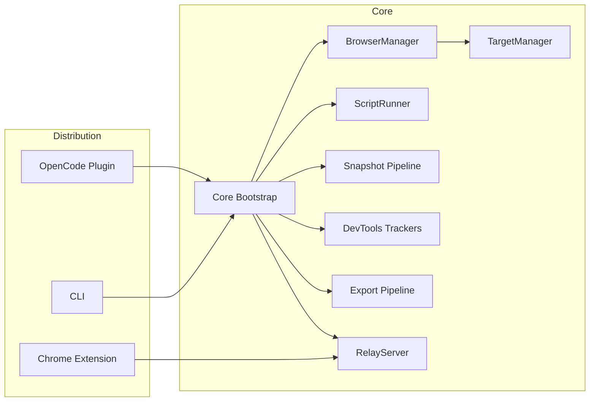
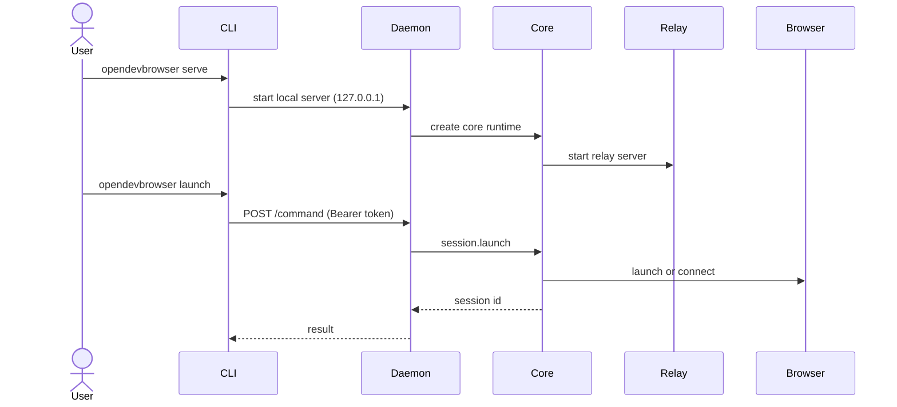
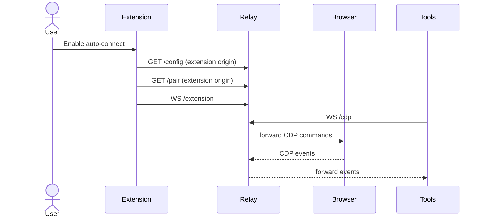

# OpenDevBrowser Architecture

This document describes the architecture of OpenDevBrowser across plugin, CLI, and extension distributions, with a security-first focus.

---

## System overview

OpenDevBrowser provides three entry points that share a single runtime core:

- **Plugin**: OpenCode runtime entry that exposes `opendevbrowser_*` tools.
- **CLI**: Installer + automation commands (daemon or single-shot `run`).
- **Extension**: Relay mode for attaching to existing logged-in tabs.

The shared runtime core is in `src/core/` and wires `BrowserManager`, `ScriptRunner`, `SkillLoader`, and `RelayServer`.

---

## Component map

---

## Runtime flows

### 1) Plugin tool invocation

1. OpenCode calls a tool like `opendevbrowser_launch`.
2. Tool validates inputs with Zod and delegates to `BrowserManager`.
3. `BrowserManager` launches or connects to a Chrome instance.
4. Tool returns structured response with session id and warnings.

### 2) CLI automation (daemon mode)

### 3) Extension relay mode

---

## Configuration and state

- **Plugin config**: `~/.config/opencode/opendevbrowser.jsonc` (optional).
- **Daemon metadata**: `~/.cache/opendevbrowser/daemon.json` (port, token, pid).
- **Extension storage**: `chrome.storage.local` (relay port, token, auto-connect).

Default extension values:
- `relayPort`: `8787`
- `autoConnect`: `true`
- `autoPair`: `true`
- `pairingEnabled`: `true`
- `pairingToken`: `null` (fetched via `/pair`)

---

## Security controls

- **Local-only CDP** by default; non-local requires opt-in config.
- **Relay binding**: `127.0.0.1` only, with token-based pairing.
- **Origin enforcement**: relay endpoints (`/config`, `/pair`) accept only `chrome-extension://` origins.
- **Timing-safe compare**: pairing tokens checked with `crypto.timingSafeEqual`.
- **Output redaction**: DevTools output strips sensitive tokens by default.
- **Sanitized export**: export pipeline removes scripts, handlers, and unsafe URLs.

---

## Testing and verification

- **Unit/integration tests** via Vitest (`npm run test`), coverage >=95%.
- **Extension build** via `npm run extension:build`.
- **CLI build** via `npm run build`.

---

## Key directories

- `src/core/`: shared runtime bootstrap.
- `src/browser/`: `BrowserManager`, `TargetManager`, session lifecycle.
- `src/tools/`: tool definitions and response shaping.
- `src/relay/`: relay server and protocol types.
- `src/cli/`: CLI commands, daemon, and installers.
- `extension/`: Chrome extension UI and background logic.
- `docs/`: plans, architecture, and operational guidance.
