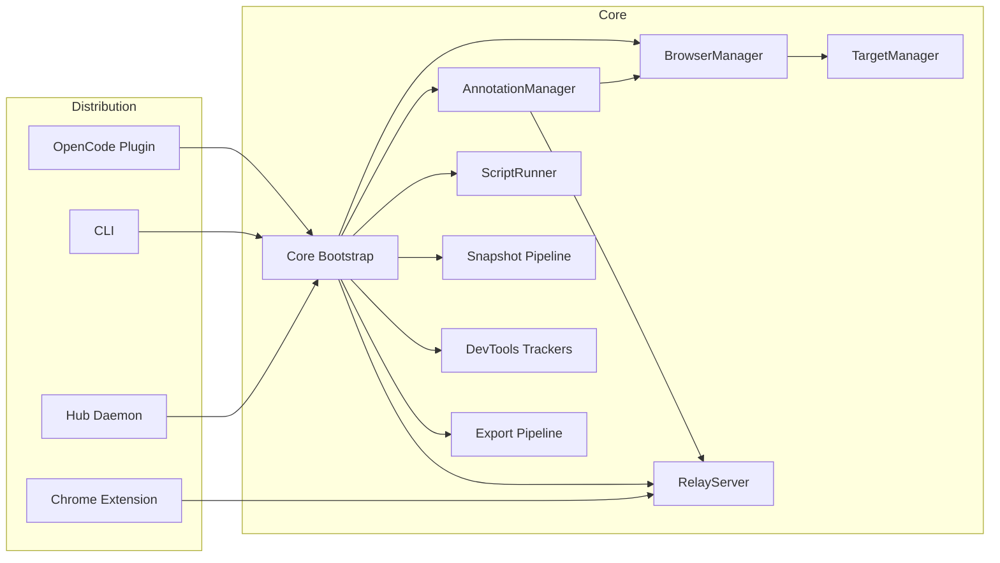
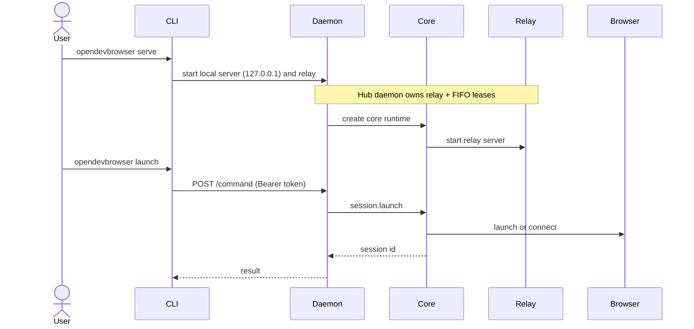
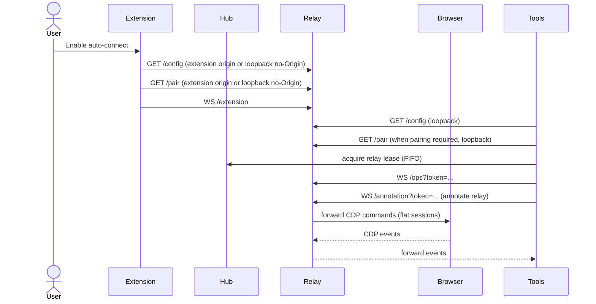

# OpenDevBrowser Architecture

This document describes the architecture of OpenDevBrowser across plugin, CLI, and extension distributions, with a security-first focus.

---

## System overview

OpenDevBrowser provides three entry points that share a single runtime core:

- **Plugin**: OpenCode runtime entry that exposes `opendevbrowser_*` tools.
- **CLI**: Installer + automation commands (daemon or single-shot `run`).
- **Extension**: Relay mode for attaching to existing logged-in tabs.
- **Hub daemon**: `opendevbrowser serve` process that owns the relay and enforces FIFO leases when hub mode is enabled.

The shared runtime core is in `src/core/` and wires `BrowserManager`, `AnnotationManager`, `ScriptRunner`, `SkillLoader`, and `RelayServer`.

The CLI installer attempts to set up daemon auto-start on first successful install (macOS LaunchAgent, Windows Task Scheduler),
so the relay is ready on user login without manual steps.

---

## Component map

---

## Runtime flows

### 1) Plugin tool invocation

1. OpenCode calls a tool like `opendevbrowser_launch`.
2. Tool validates inputs with Zod and delegates to `BrowserManager`.
3. `BrowserManager` launches or connects to a Chrome instance.
4. Tool returns structured response with session id and warnings.

### 2) CLI automation (daemon mode)

### 3) Extension relay mode

### Session modes

- `extension`: attach to an existing tab via the Chrome extension relay.
- `managed`: launch and manage a Chrome instance via Playwright (headed by default).
- `cdpConnect`: attach to an existing Chrome via CDP (`/json/version`).
- `connect` routing: local relay WS endpoints (for example `ws://127.0.0.1:<relayPort>` or `/ops`) are normalized to `/ops` and routed via the relay (`extension` mode). Legacy `/cdp` requires `--extension-legacy`.
- Launch defaults to `extension` when available; managed/CDPConnect require explicit user choice.
- Extension relay requires **Chrome 125+** and uses flat-session routing with DebuggerSession `sessionId`.
- Hub mode supports multi-client access via FIFO lease queueing; only one relay client holds the lease at a time.

---

## Configuration and state

- **Plugin config**: `~/.config/opencode/opendevbrowser.jsonc` (optional).
- **Daemon metadata**: `~/.cache/opendevbrowser/daemon.json` (port, token, pid).
- **Daemon status**: `/status` is the source of truth; cached metadata may be stale.
- **Daemon config**: `daemonPort`/`daemonToken` persisted in `opendevbrowser.jsonc` for hub discovery.
- **Extension storage**: `chrome.storage.local` (relay port, token, auto-connect).

Default extension values:
- `relayPort`: `8787`
- `autoConnect`: `true`
- `autoPair`: `true`
- `pairingEnabled`: `true`
- `pairingToken`: `null` (fetched via `/pair`)
- Background auto-retry/backoff uses `chrome.alarms` to reconnect when the relay is unreachable.

---

## Security controls

- **Local-only CDP** by default; non-local requires opt-in config.
- **Relay binding**: `127.0.0.1` only, with token-based pairing.
- **Ops auth**: `/ops` requires `?token=<relayToken>` when pairing is enabled.
- **CDP auth**: `/cdp` requires `?token=<relayToken>` when pairing is enabled (legacy).
- **Annotation auth**: `/annotation` requires `?token=<relayToken>` when pairing is enabled.
- **Origin enforcement**: `/extension` requires `chrome-extension://` origin; `/config`, `/status`, `/pair` allow extension origins and loopback no-Origin (including `Origin: null`), and reject explicit non-extension origins.
- **PNA/CORS**: preflights include `Access-Control-Allow-Private-Network: true` when requested.
- **HTTP rate limiting**: `/config`, `/status`, `/pair` are rate-limited per IP.
- **Timing-safe compare**: pairing tokens checked with `crypto.timingSafeEqual`.
- **Output redaction**: DevTools output strips sensitive tokens by default.
- **Sanitized export**: export pipeline removes scripts, handlers, and unsafe URLs.

---

## Extension relay routing (flat sessions)

Extension relay mode uses **flat CDP sessions (Chrome 125+)**. The extension CDP router:

- Lists top-level tabs and child targets for discovery.
- Auto-attaches child targets recursively (workers/OOPIF) and surfaces them in `Target.getTargets` and `Target.getTargetInfo`.
- Routes all commands and events by DebuggerSession `sessionId` (no `Target.sendMessageToTarget`).
- Maintains root vs child mappings in `TargetSessionMap` to route each `sessionId` to the correct `tabId`.
- Tracks a primary tab for relay handshake/diagnostics without disconnecting other tabs.
- Annotation relay uses a dedicated `/annotation` websocket and `annotationCommand`/`annotationResponse` messages.

When hub mode is enabled, the hub daemon is the **sole relay owner** and enforces a FIFO lease queue for multi-client safety. There is no local relay fallback in hub mode.

---

## Testing and verification

- **Unit/integration tests** via Vitest (`npm run test`), coverage >=97%.
- **Extension build** via `npm run extension:build`.
- **CLI build** via `npm run build`.

---

## Key directories

- `src/core/`: shared runtime bootstrap.
- `src/browser/`: `BrowserManager`, `TargetManager`, session lifecycle.
- `src/tools/`: tool definitions and response shaping.
- `src/relay/`: relay server and protocol types.
- `src/cli/`: CLI commands, daemon, and installers.
- `extension/`: Chrome extension UI and background logic.
- `docs/`: plans, architecture, and operational guidance.
