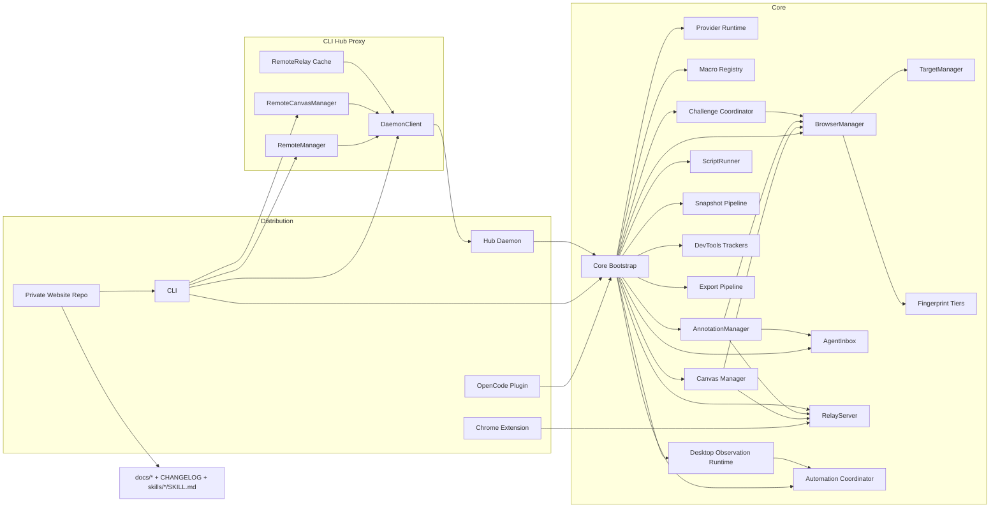
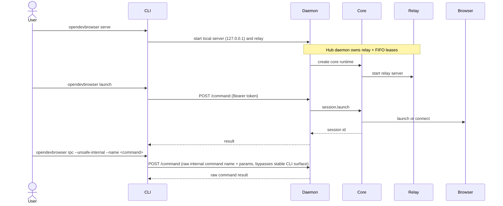
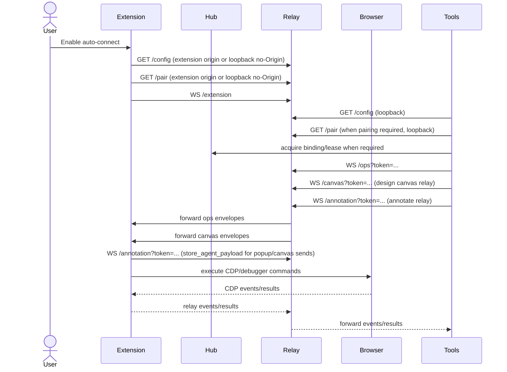
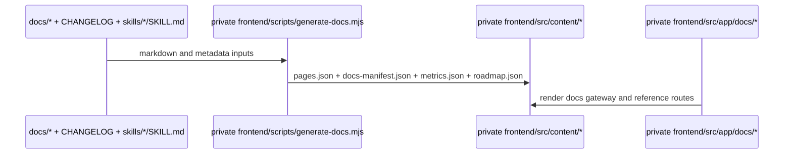

# OpenDevBrowser Architecture

This document describes the architecture of OpenDevBrowser across plugin, CLI, and extension distributions, with a security-first focus.
Status: active  
Last updated: 2026-04-11

---

## System overview

OpenDevBrowser provides four primary runtime entry points:

- **Plugin**: OpenCode runtime entry that exposes `opendevbrowser_*` tools.
- **CLI**: Installer + automation commands (daemon or single-shot `run`), plus guarded internal `rpc` passthrough for power users (unsafe, use with caution).
- **Extension**: Relay mode for attaching to existing logged-in tabs.
- **Website (private repo)**: Next.js website and generated docs viewer maintained in `opendevbrowser-website-deploy/frontend/`.
- **Hub daemon**: `opendevbrowser serve` process that owns the relay and enforces FIFO leases when hub mode is enabled.
- **Automation platform layer**: provider runtime, macro resolver, tiered fingerprint controls, and combined debug trace workflows shared across tool/CLI/daemon surfaces.

Current automation surface sizes:
- CLI commands: `72`
- Plugin tools: `65`
- `/ops` command names: `59`
- `/canvas` command names: `35`

Human-facing inventory metadata now composes through one generated manifest:
- `src/public-surface/source.ts` owns the canonical public CLI command, tool, and CLI-tool pair metadata
- `scripts/generate-public-surface-manifest.mjs` regenerates the public manifest snapshots
- `src/public-surface/generated-manifest.ts` and `.json` are the consumed inventory mirrors for runtime help, docs parity, and tests
- `src/cli/onboarding-metadata.json` owns the canonical first-contact skill, topic, quick-start commands, and onboarding doc pointers
- `src/cli/help.ts`, `src/cli/args.ts`, and `src/tools/index.ts` consume or re-export the generated manifest for human-facing command and tool inventory output
- `src/cli/help.ts` also owns the first-contact capability-highlights block for browser replay, public desktop observation, and the browser-scoped computer-use lane surfaced through `--challenge-automation-mode`
- `docs/SURFACE_REFERENCE.md` mirrors every public CLI command and tool name with those short descriptions
- `docs/CLI.md` carries the longer operator guide and help parity runbook
- `src/tools/index.ts` remains the runtime tool registry authority

The shared runtime core is in `src/core/` and wires `BrowserManager`, `CanvasManager`, `AnnotationManager`, `AgentInbox`, `ScriptRunner`, `SkillLoader`, and `RelayServer`.
`CanvasManager` lives in `src/browser/canvas-manager.ts` and composes dedicated session-sync, code-sync, starter-catalog, and runtime-preview bridge helpers while delegating document, export, framework-adapter, library-adapter, plugin, starter, kit, and token primitives to `src/canvas/` plus deterministic Figma import helpers under `src/integrations/figma/`.
Daemon-backed `canvas` CLI requests inject the caller worktree as `repoRoot`; `CanvasManager` persists that root per canvas session so relative document saves, exports, imported asset materialization, and code-sync manifest/source paths resolve against the caller repo instead of the daemon process cwd.
`AgentInbox` provides repo-local, chat-scoped delivery for popup/canvas annotation sends and the shared `annotate --stored` retrieval path.
Canonical inventory and channel contracts: `docs/SURFACE_REFERENCE.md`.
Frontend architecture and generation flow are documented in `docs/FRONTEND.md`.

The CLI installer reconciles daemon auto-start after every successful install
(macOS LaunchAgent, Windows Task Scheduler). Existing per-user entries are rechecked and repaired when they are missing or stale on
supported platforms, and when the macOS LaunchAgent is malformed; unsupported platforms are skipped and continue without auto-start. If the current CLI entrypoint is running from a
transient temp-root path, install-time reconciliation refuses to persist it and surfaces guidance to rerun `daemon install` from a
stable install location. `getAutostartStatus()` remains the canonical source of auto-start truth for both install reconciliation
and `daemon status`, and a stable persisted auto-start entry remains authoritative even when the current invocation is transient.

## Challenge orchestration ownership

The anti-bot cutover keeps blocker truth and challenge lifecycle separate on purpose:

- `src/browser/session-store.ts` remains the only blocker FSM authority.
- `src/browser/browser-manager.ts` and `src/browser/ops-browser-manager.ts` remain the only writers of surfaced blocker and challenge metadata. Existing `meta.blocker`, `meta.blockerState`, and `meta.blockerResolution` fields stay stable; additive `meta.challenge` and `meta.challengeOrchestration` are layered on top, and the public `review` surface composes that manager status with a fresh actionables capture before action.
- `src/browser/global-challenge-coordinator.ts` owns lifecycle-only state for claim, refresh, resolve, defer, expire, and release. It does not classify blockers.
- `src/challenges/` is the shared Part 2 intelligence plane. It builds canonical evidence, interprets the incident, selects one bounded lane, executes browser-native steps, verifies via manager-owned checks, and emits reclaimable yield or outcome records without becoming a second truth authority.
- `src/providers/runtime-factory.ts` plus `src/providers/browser-fallback.ts` own preserve-or-complete browser fallback transport. Responses use explicit `disposition` values: `completed`, `challenge_preserved`, `deferred`, and `failed`.
- `src/providers/registry.ts` is the sole durable anti-bot pressure authority. `src/providers/shared/anti-bot-policy.ts`, `src/providers/policy.ts`, `src/providers/index.ts`, and `src/providers/workflows.ts` read or write that registry-backed state instead of maintaining parallel durable maps.
- Provider modules keep extraction logic and `recoveryHints()` only. Shared runtime owns fallback ordering, preserve or resume decisions, and legacy compatibility translation for older fallback callers.

Legitimacy boundary:

- In scope: preserved sessions, standard browser controls, bounded auth-navigation and session-reuse attempts, bounded interaction experimentation, reclaimable human yield for secret or human-authority boundaries, and owned-environment challenge fixtures that use vendor test keys only.
- Out of scope: hidden bypasses, CAPTCHA-solving services, token harvesting, or autonomous unsandboxed solving of third-party anti-bot systems.

### Challenge automation override contract

- Public override field: `challengeAutomationMode`
- Accepted values: `off`, `browser`, `browser_with_helper`
- Effective precedence: `run > session > config`
- Generated help and docs surface this as the browser-scoped computer-use lane; it is intentionally not a desktop-agent or desktop-command family.
- Config baseline: `providers.challengeOrchestration.mode`
- `BrowserManager` and `OpsBrowserManager` remain the only surfaced challenge metadata writers.
- `meta.challengeOrchestration` and fallback `details.challengeOrchestration` can expose `mode`, `source`, `standDownReason`, and helper eligibility so stand-down decisions stay explicit.
- The optional helper bridge is browser-scoped, not a desktop agent. `browser` disables it, while `browser_with_helper` only evaluates it when the existing hard gates pass.
- Shipped builds keep desktop entitlement separate under `desktop.*`; that sibling runtime is never granted by `challengeAutomationMode`.
- Governed advanced lanes stay separately entitlement-gated and are never granted by `challengeAutomationMode`.

### Roadmap-only desktop boundary

This section is roadmap-only for any public desktop-agent claim. Shipped builds now include a public read-only desktop observation plane over the sibling desktop runtime contract plus a top-level automation coordinator, but desktop-agent behavior remains non-public and observation-only while the shipped observation default can still be opted out through `desktop.permissionLevel=off`.

- The shipped sibling runtime already uses a separate contract from `ChallengeRuntimeHandle`, `BrowserManagerLike`, and `/ops`; any future public desktop agent must preserve that separation.
- Core composition creates `desktopRuntime` beside `BrowserManager` and `OpsBrowserManager`, then exposes a non-public `observeDesktopAndVerify` entrypoint that routes desktop observation back through browser-owned review before surfacing completion.
- Minimum capability bar before any desktop-agent claim is allowed:
  - OS-level input actuation outside the browser
  - cross-window and cross-app focus management
  - desktop capture or accessibility-tree observation beyond browser DOM
  - explicit permission and consent gating
  - bounded workspace and abort controls
  - audit artifacts and replay-safe execution logs
  - a typed failure taxonomy separate from the current helper bridge
- Public docs and surfaces may describe the shipped read-only desktop observation plane, but they must not describe the current helper bridge as a desktop agent or imply that `/ops` is a desktop control channel.

---

## Component map

### Canonical ASCII map

```text
┌─────────────────────────────────────────────────────────────────┐
│                      Distribution Layer                         │
├──────────────────┬──────────────────┬──────────────────┬──────────────────────────┤
│  OpenCode Plugin │       CLI        │    Hub Daemon    │    Chrome Extension       │
│  (src/index.ts)  │ (src/cli/index)  │ (opendevbrowser  │   (extension/src/)        │
│                  │                  │      serve)     │                           │
└────────┬─────────┴────────┬─────────┴─────────┬────────┴──────────────┬────────────┘
         │                  │                  │                       │
         ▼                  ▼                  ▼                       ▼
┌─────────────────────────────────────────────────────────────────┐
│                    Core Runtime (src/core/)                    │
│  bootstrap.ts → wires managers, sibling desktop runtime,      │
│                   automation coordinator, injects ToolDeps     │
└────────┬────────────────────────────────────────────────────────┘
         │
    ┌────┴────┬─────────────┬──────────────┬──────────┬────────────┬────────────┬────────────┐
    ▼         ▼             ▼              ▼          ▼            ▼            ▼
┌────────┐ ┌────────┐ ┌──────────┐ ┌────────┐ ┌────────────┐ ┌────────────┐ ┌────────────┐
│Browser │ │Script  │ │Snapshot  │ │ Canvas │ │ Annotation │ │  Relay     │ │  Skills    │
│Manager │ │Runner  │ │Pipeline  │ │Manager │ │  Manager   │ │  Server    │ │  Loader    │
└───┬────┘ └────────┘ └──────────┘ └────┬───┘ └────────────┘ └─────┬──────┘ └────────────┘
    │                                                  │
    ▼                                                  ▼
┌────────┐                                        ┌────────────┐
│Target  │                                        │ Extension  │
│Manager │                                        │ (WS relay) │
└────────┘                                        └────────────┘
```

### Data flow

```text
Tool Call → Zod Validation → Manager/Runner → CDP/Playwright → Response
                                   ↓
                            Snapshot (AX-tree → refs)
                                   ↓
                            Action (ref → backendNodeId → DOM)
```

### Detailed dependency map (Mermaid)


```mermaid
flowchart LR
  subgraph Distribution
    Plugin[OpenCode Plugin]
    CLI[CLI]
    Hub[Hub Daemon]
    Extension[Chrome Extension]
    Frontend[Private Website Repo]
  end

  subgraph HubProxy[CLI Hub Proxy]
    DaemonClient[DaemonClient]
    RemoteManager[RemoteManager]
    RemoteCanvasManager[RemoteCanvasManager]
    RemoteRelay[RemoteRelay Cache]
  end

  subgraph Core
    CoreBootstrap[Core Bootstrap]
    BrowserManager[BrowserManager]
    TargetManager[TargetManager]
    ProviderRuntime[Provider Runtime]
    MacroRegistry[Macro Registry]
    Fingerprint[Fingerprint Tiers]
    CanvasManager[Canvas Manager]
    AnnotationManager[AnnotationManager]
    AgentInbox[AgentInbox]
    ScriptRunner[ScriptRunner]
    Snapshotter[Snapshot Pipeline]
    Devtools[DevTools Trackers]
    Exporter[Export Pipeline]
    Relay[RelayServer]
    ChallengeCoord[Challenge Coordinator]
    DesktopRuntime[Desktop Observation Runtime]
    AutomationCoordinator[Automation Coordinator]
  end

  Plugin --> CoreBootstrap
  CLI --> DaemonClient
  CLI --> RemoteManager
  CLI --> RemoteCanvasManager
  RemoteManager --> DaemonClient
  RemoteCanvasManager --> DaemonClient
  RemoteRelay --> DaemonClient
  DaemonClient --> Hub
  CLI --> CoreBootstrap
  Hub --> CoreBootstrap
  Extension --> Relay
  Frontend --> CLI
  Frontend --> Docs[docs/* + CHANGELOG + skills/*/SKILL.md]

  CoreBootstrap --> BrowserManager
  BrowserManager --> TargetManager
  CoreBootstrap --> CanvasManager
  CanvasManager --> BrowserManager
  CanvasManager --> Relay
  CoreBootstrap --> ProviderRuntime
  CoreBootstrap --> MacroRegistry
  BrowserManager --> Fingerprint
  CoreBootstrap --> AnnotationManager
  AnnotationManager --> BrowserManager
  CoreBootstrap --> AgentInbox
  AnnotationManager --> AgentInbox
  AnnotationManager --> Relay
  CoreBootstrap --> ScriptRunner
  CoreBootstrap --> Snapshotter
  CoreBootstrap --> Devtools
  CoreBootstrap --> Exporter
  CoreBootstrap --> Relay
  CoreBootstrap --> ChallengeCoord
  CoreBootstrap --> DesktopRuntime
  CoreBootstrap --> AutomationCoordinator
  ChallengeCoord --> BrowserManager
  DesktopRuntime --> AutomationCoordinator
```

---

## Runtime flows

### 1) Plugin tool invocation

1. OpenCode calls a tool like `opendevbrowser_launch`.
2. Tool validates inputs with Zod and delegates to `BrowserManager`.
3. `BrowserManager` launches or connects to a Chrome instance.
4. Optional automation flows route through provider runtime (`search`/`fetch`/`crawl`/`post`) and macro resolution.
5. Tool returns structured response with session id, trace-aware diagnostics, and warnings.

### 2) CLI automation (daemon mode)


```mermaid
sequenceDiagram
  actor User
  participant CLI
  participant Daemon
  participant Core
  participant Relay
  participant Browser

  User->>CLI: opendevbrowser serve
  CLI->>Daemon: start local server (127.0.0.1) and relay
  Note over Daemon,Relay: Hub daemon owns relay + FIFO leases
  Daemon->>Core: create core runtime
  Core->>Relay: start relay server
  User->>CLI: opendevbrowser launch
  CLI->>Daemon: POST /command (Bearer token)
  Daemon->>Core: session.launch
  Core->>Browser: launch or connect
  Core-->>Daemon: session id
  Daemon-->>CLI: result
  User->>CLI: opendevbrowser rpc --unsafe-internal --name <command>
  CLI->>Daemon: POST /command (raw internal command name + params, bypasses stable CLI surface)
  Daemon-->>CLI: raw command result
```

`rpc` is intentionally CLI-only and internal. It can invoke unstable daemon command paths and should be treated as a last-resort power-user interface.

### 3) Extension relay mode


```mermaid
sequenceDiagram
  actor User
  participant Extension
  participant Hub
  participant Relay
  participant Browser
  participant Tools

  User->>Extension: Enable auto-connect
  Extension->>Relay: GET /config (extension origin or loopback no-Origin)
  Extension->>Relay: GET /pair (extension origin or loopback no-Origin)
  Extension->>Relay: WS /extension
  Tools->>Relay: GET /config (loopback)
  Tools->>Relay: GET /pair (when pairing required, loopback)
  Tools->>Hub: acquire binding/lease when required
  Tools->>Relay: WS /ops?token=...
  Tools->>Relay: WS /canvas?token=... (design canvas relay)
  Tools->>Relay: WS /annotation?token=... (annotate relay)
  Relay->>Extension: forward ops envelopes
  Relay->>Extension: forward canvas envelopes
  Extension->>Relay: WS /annotation?token=... (store_agent_payload for popup/canvas sends)
  Extension->>Browser: execute CDP/debugger commands
  Browser-->>Extension: CDP events/results
  Extension-->>Relay: relay events/results
  Relay-->>Tools: forward events/results
```

### 4) Website docs/content generation (private repo)


```mermaid
sequenceDiagram
  participant Sources as docs/* + CHANGELOG + skills/*/SKILL.md
  participant Generator as private frontend/scripts/generate-docs.mjs
  participant Content as private frontend/src/content/*
  participant Next as private frontend/src/app/docs/*

  Sources->>Generator: markdown and metadata inputs
  Generator->>Content: pages.json + docs-manifest.json + metrics.json + roadmap.json
  Next->>Content: render docs gateway and reference routes
```

### Session modes

- `extension`: attach to an existing tab via the Chrome extension relay.
- `managed`: launch and manage a Chrome instance via Playwright (headed by default).
- `cdpConnect`: attach to an existing Chrome via CDP (`/json/version`).
- `connect` routing: local relay WS endpoints (for example `ws://127.0.0.1:<relayPort>` or `/ops`) are normalized to `/ops` and routed via the relay (`extension` mode). Legacy `/cdp` requires `--extension-legacy`.
- Launch defaults to `extension` when available; managed/CDPConnect require explicit user choice.
- Extension relay requires **Chrome 125+** and uses flat-session routing with DebuggerSession `sessionId`.
- Hub mode supports multi-client access. `/ops` accepts multiple clients, while FIFO binding/lease coordination applies to legacy `/cdp` and protected extension-session command paths.

### Relay channel contracts

- `/ops` is the default high-level extension channel with explicit commands (`session.*`, `targets.*`, `page.*`, `nav.*`, `interact.*`, `dom.*`, `export.*`, `devtools.*`).
- `/ops` envelopes: `ops_hello`, `ops_request`, `ops_response`, `ops_error`, `ops_event`, `ops_chunk`, `ops_ping`, `ops_pong`.
- `/canvas` is a dedicated design-canvas channel for session handshakes, governance-plan gating, canonical document mutation requests, extension-hosted design-tab editor sync, overlay selection, preview refresh, and feedback events.
- `/canvas` design tabs consume a canonical HTML preview generated in core. `canvas.tab.open` is the public command; internal `canvas.tab.sync` keeps extension-hosted design tabs aligned with the same core-rendered materialization after public mutations. Extension history clicks emit the internal `canvas_event` type `canvas_history_requested`, but the lease-governed mutation still runs through public `canvas.history.undo` or `canvas.history.redo`.
- `/canvas` envelopes: `canvas_hello`, `canvas_request`, `canvas_response`, `canvas_error`, `canvas_event`, `canvas_chunk`, `canvas_ping`, `canvas_pong`.
- `/cdp` is legacy and forwards raw CDP commands via `forwardCDPCommand` envelopes (`id`, `method`, `params`, optional `sessionId`) and relays events/responses back.
- `/annotation` remains a dedicated channel for annotation command/event/response flow. It carries capture commands (`start`, `cancel`), shared stored retrieval (`fetch_stored`), and extension send delivery (`store_agent_payload`).
- Full command names and payload examples are documented in `docs/SURFACE_REFERENCE.md`.

### Agent inbox delivery flow

- `chat.message` and `experimental.chat.system.transform` register active `sessionID` values as chat scope keys for the current worktree.
- Extension popup, canvas, and in-page annotation `Send` actions dispatch `annotation:sendPayload` to the extension background, which calls `store_agent_payload` over `/annotation`.
- During core bootstrap, the relay registers a local store handler; that handler calls `AgentInbox.enqueue(...)`. Shared entries are written under `.opendevbrowser/annotate/agent-inbox.jsonl`; active scope metadata is stored in `.opendevbrowser/annotate/agent-scopes.json`.
- Shared persistence strips screenshots, keeps asset refs only, and bounds storage to `200` entries total, `50` unread entries, `7` days TTL, and duplicate suppression within `60` seconds.
- `experimental.chat.system.transform` peeks only the current scope, injects up to `20` items or `256 KiB` of serialized system text, and marks injected items consumed.
- `annotate --stored` reads the shared inbox first and falls back to the extension-local stored payload when no shared item is available.

### Multi-tab concurrency contract

- Canonical contract: `docs/CLI.md` (concurrency semantics) and `src/config.ts` (`parallelism` settings).
- Execution key: `ExecutionKey = (sessionId, targetId)`.
- Command taxonomy:
  - `TargetScoped`: `goto`, `wait`, `snapshot`, `review`, interaction commands, DOM commands, `page.screenshot`, `page.dialog`, export/devtools target-bound commands.
  - `SessionStructural`: connect/disconnect, target/page create/close/select/list.
- Scheduler guarantees:
  - Same target: strict FIFO.
  - Different targets in one session: parallel up to governor `effectiveParallelCap`.
- Governor policy source of truth: `src/config.ts` (`parallelism` block), passed to extension `/ops` at `session.connect`.
- Legacy `/cdp` remains compatibility-only (`effectiveParallelCap=1`).
- Extension headless is unsupported by contract; headless extension launch/connect intent fails with `unsupported_mode`.
- Declared intentional mismatches are registry-bound in `docs/PARITY_DECLARED_DIVERGENCES.md`; undeclared parity mismatches fail gates.

### Automation platform surfaces

- Provider runtime supports source policy routing (`auto|web|community|social|shopping|all`) with per-provider timeouts, retries, circuit-breaker state, and partial-success envelopes.
- Workflow wrappers expose finalized skill-aligned entrypoints:
  - `research.run` / `opendevbrowser_research_run` / `opendevbrowser research run`
  - `shopping.run` / `opendevbrowser_shopping_run` / `opendevbrowser shopping run`
  - `product.video.run` / `opendevbrowser_product_video_run` / `opendevbrowser product-video run`
- Those workflow wrappers also expose `challengeAutomationMode` (`off|browser|browser_with_helper`) as a run-scoped override with `run > session > config` precedence.
- Workflow runtime primitives are layered as:
  - `timebox` (strict `days|from|to` resolution)
  - `orchestrator` (source/provider fanout + partial-failure accumulation)
  - `enrichment` (engagement/recency/date-confidence)
  - `renderer` (`compact|json|md|context|path`)
  - `artifact writer` (owner-only paths, TTL metadata, cleanup support)
- Macro engine resolves `@macro(...)` expressions into provider operations (`src/macros/*`) and is exposed through tool/CLI/daemon (`macro_resolve`, `macro-resolve`, `macro.resolve`) with resolve-only and execute modes.
- Execute-mode macro responses keep existing shapes and add metadata fields: `meta.tier.selected`, `meta.tier.reasonCode`, `meta.provenance.provider`, `meta.provenance.retrievalPath`, and `meta.provenance.retrievedAt`.
- Diagnostics include a session-first inspection lane (`session.inspect`, `opendevbrowser_session_inspector`, `session-inspector`) plus console/network/exception trackers and a combined debug bundle endpoint (`debug_trace_snapshot`, `debug-trace-snapshot`, `devtools.debugTraceSnapshot`).
- Design canvas surfaces expose `canvas.execute` / `opendevbrowser_canvas` / `opendevbrowser canvas` and are layered as:
  - `session handshake + attach` (`canvas.session.open`, `canvas.session.attach`, `canvas.capabilities.get`) for governance, plan requirements, same-user observer joins, and explicit lease reclaim
  - `document store` (`canvas.document.load`, `canvas.document.import`, `canvas.document.patch`, `canvas.document.save`, `canvas.document.export`) for repo-native JSON artifacts, typed Yjs-backed document state, Figma file or node ingestion, governance completion, save/export policy gates, and patch-driven preview re-materialization
  - `history` (`canvas.history.undo`, `canvas.history.redo`) for lease-held undo/redo, selection and viewport preimages, no-op-before-first-mutation behavior, deterministic invalidation when external revision drift makes the recorded stack stale, and extension design-tab history controls that emit `canvas_history_requested` before public undo/redo execution
  - `inventory` (`canvas.inventory.list`, `canvas.inventory.insert`, plus `inventory.promote|update|remove` patch ops) for reusable stage-node promotion, document-backed component catalogs, built-in kit catalog inventory, and governed reinsertion onto the active page
  - `starters` (`canvas.starter.list`, `canvas.starter.apply`) for built-in starter discovery, automatic generation-plan seeding, kit token merges, required inventory installation, and starter shell materialization with semantic fallback for unsupported framework or adapter requests; starter responses prefer `libraryAdapterId` for the resolved kit adapter while retaining `adapterId` as a compatibility alias distinct from code-sync `frameworkAdapterId`
  - `code sync` (`canvas.code.bind`, `canvas.code.unbind`, `canvas.code.pull`, `canvas.code.push`, `canvas.code.status`, `canvas.code.resolve`) for framework-adapter-backed round-trip bindings, manifest persistence under `.opendevbrowser/canvas/code-sync/<documentId>/<bindingId>.json`, built-in React/HTML/custom-elements/Vue/Svelte lanes, repo-local BYO adapter plugins, watch-driven drift detection, deterministic migration/plugin failure reason codes, and conflict resolution
  - `live editor + preview + overlay` (`canvas.tab.open`, `canvas.overlay.mount`, `canvas.preview.render`, `canvas.preview.refresh`) for browser-backed iteration; extension mode uses `extension/canvas.html` as the same-origin infinite-canvas host with pages, layers, properties, token collection or mode authoring, alias or binding controls, keyboard shortcuts, and extension-stage region annotation, while preview targets prefer `bound_app_runtime` reconciliation for opted-in bindings and fall back to core-generated `canvas_html` projections when runtime bridge preflight fails or no bound sync root exists
  - `feedback` (`canvas.feedback.poll`, `canvas.feedback.subscribe`, `canvas.feedback.next`, `canvas.feedback.unsubscribe`) for render, validation, export, editor-patch, and target-filtered feedback signals; `canvas.feedback.poll` remains the snapshot query, while CLI and tool consumers now share the same public pull-stream contract through `subscribe -> next -> unsubscribe`
  - `figma import` (`canvas.document.import`) resolves auth from config or `FIGMA_ACCESS_TOKEN`, calls the official Figma REST file, node, image, and optional `variables/local` endpoints, caches image/SVG receipts under `.opendevbrowser/canvas/assets/figma/<fileKey>/`, records `document.meta.imports[]` provenance, and keeps imports framework-neutral unless a matching framework adapter explicitly materializes the result
- The canonical validator for the shipped canvas surface is `scripts/canvas-competitive-validation.mjs`; it groups send-to-agent, feedback/history, adapter conformance, framework/library fixtures, plugin packaging negatives, inventory/starters, token round-trip, surface parity, Figma fixture import, configured plugin fixture status, and optional live Figma smoke into one report plus per-group logs.
- Legal/compliance gating for scrape-first adapters is enforced with per-provider review checklists (review date, allowed surfaces, prohibited flows, reviewer, expiry, signed-off status) and blocks expired/invalid enablement.
- Session coherence includes cookie import validation and tiered fingerprint controls:
  - Managed and `cdpConnect` sessions automatically attempt to import readable cookies from the discovered system Chrome-family profile before first navigation; extension sessions reuse the already logged-in browser tab instead.
  - Provider cookie policy defaults are configurable via `providers.cookiePolicy` (`off|auto|required`) and `providers.cookieSource` (`file|env|inline`).
  - Workflow wrappers expose per-run overrides: `useCookies` and `cookiePolicyOverride`.
  - Effective policy is deterministic: override > `useCookies` > config default.
  - `required` policy can fail fast with `reasonCode=auth_required` when cookie load/import/verification cannot establish authenticated state.
  - Workflow metrics include cookie diagnostics at `meta.metrics.cookie_diagnostics` and `meta.metrics.cookieDiagnostics`.
  - Tier 1: coherence checks/warnings (default on)
  - Tier 2: runtime hardening + rotation policy (default on, continuous signals)
  - Tier 3: adaptive canary/fallback track (default on, continuous signals)
- Structured JSON logging/audit provides request correlation (`requestId`) and redaction-safe audit entries for write paths.

---

## Configuration and state

- **Plugin config**: `~/.config/opencode/opendevbrowser.jsonc` (optional).
- **Daemon metadata**: `~/.cache/opendevbrowser/daemon.json` (port, token, pid).
- **Daemon status**: `/status` is the source of truth; cached metadata may be stale.
- **Daemon config**: `daemonPort`/`daemonToken` persisted in `opendevbrowser.jsonc` for hub discovery.
- **Extension storage**: `chrome.storage.local` (relay port, token, auto-connect).
- **Frontend generated content (private repo)**: `opendevbrowser-website-deploy/frontend/src/content/*` (generated docs/metrics/roadmap JSON).

Default extension values:
- `relayPort`: `8787`
- `autoConnect`: `true`
- `autoPair`: `true`
- `pairingEnabled`: `true`
- `pairingToken`: `null` (fetched via `/pair`)
- Background auto-retry/backoff uses `chrome.alarms` for extension auto-connect retries (`/config` + `/pair`) when the relay is unreachable.

---

## Security controls

- **Local-only CDP** by default; non-local requires opt-in config.
- **Relay binding**: `127.0.0.1` only, with token-based pairing.
- **Ops auth**: `/ops` requires `?token=<relayToken>` when pairing is enabled.
- **Canvas auth**: `/canvas` requires `?token=<relayToken>` when pairing is enabled.
- **CDP auth**: `/cdp` requires `?token=<relayToken>` when pairing is enabled (legacy).
- **Annotation auth**: `/annotation` requires `?token=<relayToken>` when pairing is enabled.
- **Origin enforcement**: `/extension` requires `chrome-extension://` origin; `/config`, `/status`, `/pair` allow extension origins and loopback no-Origin (including `Origin: null`), and reject explicit non-extension origins.
- **PNA/CORS**: preflights include `Access-Control-Allow-Private-Network: true` when requested.
- **HTTP rate limiting**: `/config`, `/status`, `/pair` are rate-limited per IP.
- **Timing-safe compare**: pairing tokens checked with `crypto.timingSafeEqual`.
- **Output redaction**: DevTools output strips sensitive tokens by default.
- **Sanitized export**: export pipeline removes scripts, handlers, and unsafe URLs.

---

## Extension relay routing (flat sessions)

Extension relay mode uses **flat CDP sessions (Chrome 125+)**. The extension CDP router:

- Lists top-level tabs and child targets for discovery.
- Auto-attaches child targets recursively (workers/OOPIF) and surfaces them in `Target.getTargets` and `Target.getTargetInfo`.
- Routes all commands and events by DebuggerSession `sessionId` (no `Target.sendMessageToTarget`).
- Maintains root vs child mappings in `TargetSessionMap` to route each `sessionId` to the correct `tabId`.
- Tracks a primary tab for relay handshake/diagnostics without disconnecting other tabs.
- Annotation relay uses a dedicated `/annotation` websocket and `annotationCommand`/`annotationResponse` messages.
- Design-canvas relay uses a dedicated `/canvas` websocket and `canvas_*` envelopes for design-tab and overlay operations.

When hub mode is enabled, the hub daemon is the **sole relay owner** and enforces a FIFO lease queue for multi-client safety. There is no local relay fallback in hub mode.

---

## Testing and verification

- **Unit/integration tests** via Vitest (`npm run test`), coverage >=97%.
- **Extension build** via `npm run extension:build`.
- **CLI build** via `npm run build`.
- **Private website checks** via `npm run lint --prefix frontend && npm run typecheck --prefix frontend && npm run build --prefix frontend` in `opendevbrowser-website-deploy`.
- **CLI inventory/help parity check** via `npx opendevbrowser --help` and `npx opendevbrowser help`.
- **CLI onboarding proof lane** via `node scripts/cli-onboarding-smoke.mjs` (generated help -> bundled quick-start guidance -> minimal managed happy path).
- **Docs drift gate** via `node scripts/docs-drift-check.mjs`.
- **Zombie duplicate audit** via `node scripts/audit-zombie-files.mjs`.
- **Chrome extension compliance gate** via `node scripts/chrome-store-compliance-check.mjs`.
- **Parity gate** via `tests/parity-matrix.test.ts` (contract coverage for CLI/tool/runtime surface checks + mode coverage).
- **Provider performance gate** via `tests/providers-performance-gate.test.ts` (deterministic fixture SLO checks).
- **Strict live release gates** via `node scripts/provider-direct-runs.mjs --release-gate` and `node scripts/live-regression-direct.mjs --release-gate` (active live release proof layer).
- **Release checklist** in `docs/RELEASE_RUNBOOK.md` with evidence tracking in the current version-scoped release ledger (for this cycle: `docs/RELEASE_0.0.17_EVIDENCE.md`).
- **Benchmark fixture manifest** in `docs/benchmarks/provider-fixtures.md`.
- **First-run onboarding checklist** in `docs/FIRST_RUN_ONBOARDING.md`.

## Skill artifacts and operational gates

`opendevbrowser-best-practices` includes codified operational artifacts under
`skills/opendevbrowser-best-practices/artifacts/`:

- `provider-workflows.md`
- `parity-gates.md`
- `debug-trace-playbook.md`
- `fingerprint-tiers.md`
- `macro-workflows.md`
- `command-channel-reference.md`

Template assets for parity and channel checks live under
`skills/opendevbrowser-best-practices/assets/templates/`.

`opendevbrowser-design-agent` adds contract-first frontend execution assets under
`skills/opendevbrowser-design-agent/`, including:

- `artifacts/design-workflows.md`
- `artifacts/design-contract-playbook.md`
- `artifacts/frontend-evaluation-rubric.md`
- `artifacts/external-pattern-synthesis.md`
- `artifacts/research-harvest-workflow.md`
- `artifacts/design-release-gate.md`
- `assets/templates/design-contract.v1.json`
- `assets/templates/canvas-generation-plan.design.v1.json`
- `assets/templates/reference-pattern-board.v1.json`
- `assets/templates/design-release-gate.v1.json`
- `scripts/design-workflow.sh`
- `scripts/extract-canvas-plan.sh`

Skill install/discovery sync covers `opencode`, `codex`, `claudecode`, and `ampcli`
ecosystems (with legacy `claude`/`amp` aliases preserved), and path discovery is documented
in `README.md` and `docs/CLI.md`.

Validation script:

```bash
./skills/opendevbrowser-best-practices/scripts/validate-skill-assets.sh
./skills/opendevbrowser-design-agent/scripts/validate-skill-assets.sh
```

---

## Key directories

- `src/core/`: shared runtime bootstrap.
- `src/browser/`: `BrowserManager`, `OpsBrowserManager`, `CanvasManager`, annotation/runtime bridge clients, and session lifecycle.
- `src/browser/fingerprint/`: Tier 1/2/3 fingerprint policy + adaptive controls.
- `src/canvas/`: document store, repo persistence, export pipeline, code-sync helpers, framework adapters, library adapters, adapter plugins, kit/starter catalogs, and token references.
- `src/integrations/figma/`: Figma auth, client, normalize, URL, mapper, and asset helpers for deterministic import.
- `src/providers/`: provider contracts, registry, runtime policy, and first-party adapters across `community/`, `shopping/`, `social/`, `web/`, plus shared helpers in `shared/` and guardrails in `safety/`.
- `src/providers/workflows.ts`: research/shopping/product-video orchestrators and compliance/alert gates.
- `src/providers/timebox.ts`: strict timebox resolver and filtering primitives.
- `src/providers/{renderer.ts,artifacts.ts,enrichment.ts}`: render modes, artifact lifecycle, and enrichment scores.
- `src/macros/`: macro parser/registry and pack definitions.
- `src/devtools/`: console/network/exception trackers and debug bundle channels.
- `src/tools/`: tool definitions and response shaping.
- `src/relay/`: relay server and protocol types.
- `src/cli/`: CLI commands, daemon/autostart, `DaemonClient`, `RemoteManager`, `RemoteCanvasManager`, relay status cache, and installers.
- `src/cli/commands/artifacts.ts`: artifact lifecycle cleanup (`artifacts cleanup --expired-only`).
- `extension/`: Chrome extension UI and background logic.
- `opendevbrowser-website-deploy/frontend/`: private website app and generated content pipeline.
- `docs/`: plans, architecture, and operational guidance.
