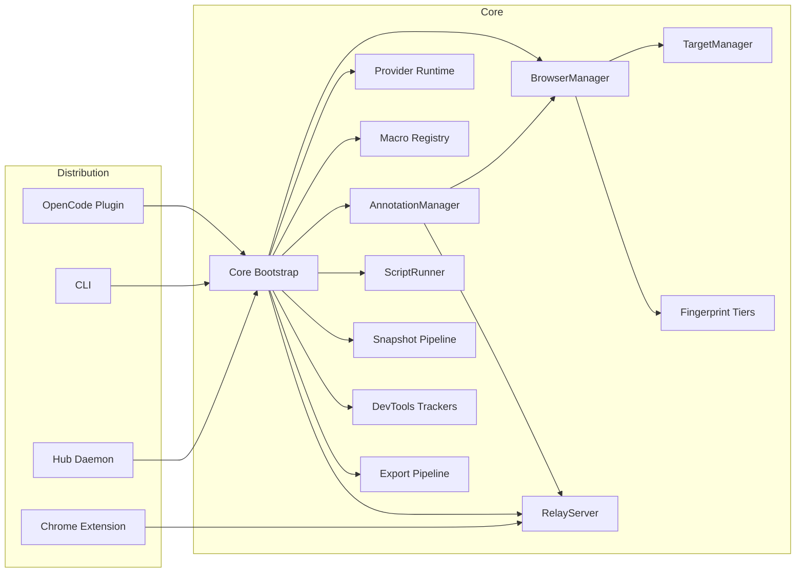

# OpenDevBrowser Architecture

This document describes the architecture of OpenDevBrowser across plugin, CLI, and extension distributions, with a security-first focus.

---

## System overview

OpenDevBrowser provides three entry points that share a single runtime core:

- **Plugin**: OpenCode runtime entry that exposes `opendevbrowser_*` tools.
- **CLI**: Installer + automation commands (daemon or single-shot `run`), plus guarded internal `rpc` passthrough for power users (unsafe, use with caution).
- **Extension**: Relay mode for attaching to existing logged-in tabs.
- **Hub daemon**: `opendevbrowser serve` process that owns the relay and enforces FIFO leases when hub mode is enabled.
- **Automation platform layer**: provider runtime, macro resolver, tiered fingerprint controls, and combined debug trace workflows shared across tool/CLI/daemon surfaces.

Current surface sizes:
- CLI commands: `54`
- Plugin tools: `47`
- `/ops` command names: `36`

The shared runtime core is in `src/core/` and wires `BrowserManager`, `AnnotationManager`, `ScriptRunner`, `SkillLoader`, and `RelayServer`.
Canonical inventory and channel contracts: `docs/SURFACE_REFERENCE.md`.

The CLI installer attempts to set up daemon auto-start on first successful install
(macOS LaunchAgent, Windows Task Scheduler). Unsupported platforms are skipped and continue without auto-start.

---

## Component map



---

## Runtime flows

### 1) Plugin tool invocation

1. OpenCode calls a tool like `opendevbrowser_launch`.
2. Tool validates inputs with Zod and delegates to `BrowserManager`.
3. `BrowserManager` launches or connects to a Chrome instance.
4. Optional automation flows route through provider runtime (`search`/`fetch`/`crawl`/`post`) and macro resolution.
5. Tool returns structured response with session id, trace-aware diagnostics, and warnings.

### 2) CLI automation (daemon mode)


`rpc` is intentionally CLI-only and internal. It can invoke unstable daemon command paths and should be treated as a last-resort power-user interface.

### 3) Extension relay mode


### Session modes

- `extension`: attach to an existing tab via the Chrome extension relay.
- `managed`: launch and manage a Chrome instance via Playwright (headed by default).
- `cdpConnect`: attach to an existing Chrome via CDP (`/json/version`).
- `connect` routing: local relay WS endpoints (for example `ws://127.0.0.1:<relayPort>` or `/ops`) are normalized to `/ops` and routed via the relay (`extension` mode). Legacy `/cdp` requires `--extension-legacy`.
- Launch defaults to `extension` when available; managed/CDPConnect require explicit user choice.
- Extension relay requires **Chrome 125+** and uses flat-session routing with DebuggerSession `sessionId`.
- Hub mode supports multi-client access. `/ops` accepts multiple clients, while FIFO binding/lease coordination applies to legacy `/cdp` and protected extension-session command paths.

### Relay channel contracts

- `/ops` is the default high-level extension channel with explicit commands (`session.*`, `targets.*`, `page.*`, `nav.*`, `interact.*`, `dom.*`, `export.*`, `devtools.*`).
- `/ops` envelopes: `ops_hello`, `ops_request`, `ops_response`, `ops_error`, `ops_event`, `ops_chunk`, `ops_ping`, `ops_pong`.
- `/cdp` is legacy and forwards raw CDP commands via `forwardCDPCommand` envelopes (`id`, `method`, `params`, optional `sessionId`) and relays events/responses back.
- `/annotation` remains a dedicated channel for annotation command/event/response flow.
- Full command names and payload examples are documented in `docs/SURFACE_REFERENCE.md`.

### Automation platform surfaces

- Provider runtime supports source policy routing (`auto|web|community|social|shopping|all`) with per-provider timeouts, retries, circuit-breaker state, and partial-success envelopes.
- Workflow wrappers expose finalized skill-aligned entrypoints:
  - `research.run` / `opendevbrowser_research_run` / `opendevbrowser research run`
  - `shopping.run` / `opendevbrowser_shopping_run` / `opendevbrowser shopping run`
  - `product.video.run` / `opendevbrowser_product_video_run` / `opendevbrowser product-video run`
- Workflow runtime primitives are layered as:
  - `timebox` (strict `days|from|to` resolution)
  - `orchestrator` (source/provider fanout + partial-failure accumulation)
  - `enrichment` (engagement/recency/date-confidence)
  - `renderer` (`compact|json|md|context|path`)
  - `artifact writer` (owner-only paths, TTL metadata, cleanup support)
- Macro engine resolves `@macro(...)` expressions into provider operations (`src/macros/*`) and is exposed through tool/CLI/daemon (`macro_resolve`, `macro-resolve`, `macro.resolve`) with resolve-only and execute modes.
- Execute-mode macro responses keep existing shapes and add metadata fields: `meta.tier.selected`, `meta.tier.reasonCode`, `meta.provenance.provider`, `meta.provenance.retrievalPath`, and `meta.provenance.retrievedAt`.
- Diagnostics include console/network/exception trackers and a combined debug bundle endpoint (`debug_trace_snapshot`, `debug-trace-snapshot`, `devtools.debugTraceSnapshot`).
- Legal/compliance gating for scrape-first adapters is enforced with per-provider review checklists (review date, allowed surfaces, prohibited flows, reviewer, expiry, signed-off status) and blocks expired/invalid enablement.
- Session coherence includes cookie import validation and tiered fingerprint controls:
  - Tier 1: coherence checks/warnings (default on)
  - Tier 2: runtime hardening + rotation policy (default on, continuous signals)
  - Tier 3: adaptive canary/fallback track (default on, continuous signals)
- Structured JSON logging/audit provides request correlation (`requestId`) and redaction-safe audit entries for write paths.

---

## Configuration and state

- **Plugin config**: `~/.config/opencode/opendevbrowser.jsonc` (optional).
- **Daemon metadata**: `~/.cache/opendevbrowser/daemon.json` (port, token, pid).
- **Daemon status**: `/status` is the source of truth; cached metadata may be stale.
- **Daemon config**: `daemonPort`/`daemonToken` persisted in `opendevbrowser.jsonc` for hub discovery.
- **Extension storage**: `chrome.storage.local` (relay port, token, auto-connect).

Default extension values:
- `relayPort`: `8787`
- `autoConnect`: `true`
- `autoPair`: `true`
- `pairingEnabled`: `true`
- `pairingToken`: `null` (fetched via `/pair`)
- Background auto-retry/backoff uses `chrome.alarms` for extension auto-connect retries (`/config` + `/pair`) when the relay is unreachable.

---

## Security controls

- **Local-only CDP** by default; non-local requires opt-in config.
- **Relay binding**: `127.0.0.1` only, with token-based pairing.
- **Ops auth**: `/ops` requires `?token=<relayToken>` when pairing is enabled.
- **CDP auth**: `/cdp` requires `?token=<relayToken>` when pairing is enabled (legacy).
- **Annotation auth**: `/annotation` requires `?token=<relayToken>` when pairing is enabled.
- **Origin enforcement**: `/extension` requires `chrome-extension://` origin; `/config`, `/status`, `/pair` allow extension origins and loopback no-Origin (including `Origin: null`), and reject explicit non-extension origins.
- **PNA/CORS**: preflights include `Access-Control-Allow-Private-Network: true` when requested.
- **HTTP rate limiting**: `/config`, `/status`, `/pair` are rate-limited per IP.
- **Timing-safe compare**: pairing tokens checked with `crypto.timingSafeEqual`.
- **Output redaction**: DevTools output strips sensitive tokens by default.
- **Sanitized export**: export pipeline removes scripts, handlers, and unsafe URLs.

---

## Extension relay routing (flat sessions)

Extension relay mode uses **flat CDP sessions (Chrome 125+)**. The extension CDP router:

- Lists top-level tabs and child targets for discovery.
- Auto-attaches child targets recursively (workers/OOPIF) and surfaces them in `Target.getTargets` and `Target.getTargetInfo`.
- Routes all commands and events by DebuggerSession `sessionId` (no `Target.sendMessageToTarget`).
- Maintains root vs child mappings in `TargetSessionMap` to route each `sessionId` to the correct `tabId`.
- Tracks a primary tab for relay handshake/diagnostics without disconnecting other tabs.
- Annotation relay uses a dedicated `/annotation` websocket and `annotationCommand`/`annotationResponse` messages.

When hub mode is enabled, the hub daemon is the **sole relay owner** and enforces a FIFO lease queue for multi-client safety. There is no local relay fallback in hub mode.

---

## Testing and verification

- **Unit/integration tests** via Vitest (`npm run test`), coverage >=97%.
- **Extension build** via `npm run extension:build`.
- **CLI build** via `npm run build`.
- **Parity gate** via `tests/parity-matrix.test.ts` (CLI/tool/runtime surface checks + mode coverage).
- **Provider performance gate** via `tests/providers-performance-gate.test.ts` (deterministic fixture SLO checks).
- **Release checklist** in `docs/RELEASE_PARITY_CHECKLIST.md`.
- **Benchmark fixture manifest** in `docs/benchmarks/provider-fixtures.md`.

## Skill artifacts and operational gates

`opendevbrowser-best-practices` includes codified operational artifacts under
`skills/opendevbrowser-best-practices/artifacts/`:

- `provider-workflows.md`
- `parity-gates.md`
- `debug-trace-playbook.md`
- `fingerprint-tiers.md`
- `macro-workflows.md`
- `command-channel-reference.md`

Template assets for parity and channel checks live under
`skills/opendevbrowser-best-practices/assets/templates/`.

Skill install/discovery sync covers `opencode`, `codex`, `claudecode`, and `ampcli`
ecosystems (with legacy `claude`/`amp` aliases preserved), and path discovery is documented
in `README.md` and `docs/CLI.md`.

Validation script:

```bash
./skills/opendevbrowser-best-practices/scripts/validate-skill-assets.sh
```

---

## Key directories

- `src/core/`: shared runtime bootstrap.
- `src/browser/`: `BrowserManager`, `TargetManager`, session lifecycle.
- `src/browser/fingerprint/`: Tier 1/2/3 fingerprint policy + adaptive controls.
- `src/providers/`: provider contracts, registry, runtime policy, and first-party adapters.
- `src/providers/workflows.ts`: research/shopping/product-video orchestrators and compliance/alert gates.
- `src/providers/timebox.ts`: strict timebox resolver and filtering primitives.
- `src/providers/{renderer.ts,artifacts.ts,enrichment.ts}`: render modes, artifact lifecycle, and enrichment scores.
- `src/macros/`: macro parser/registry and pack definitions.
- `src/devtools/`: console/network/exception trackers and debug bundle channels.
- `src/tools/`: tool definitions and response shaping.
- `src/relay/`: relay server and protocol types.
- `src/cli/`: CLI commands, daemon, and installers.
- `src/cli/commands/artifacts.ts`: artifact lifecycle cleanup (`artifacts cleanup --expired-only`).
- `extension/`: Chrome extension UI and background logic.
- `docs/`: plans, architecture, and operational guidance.
