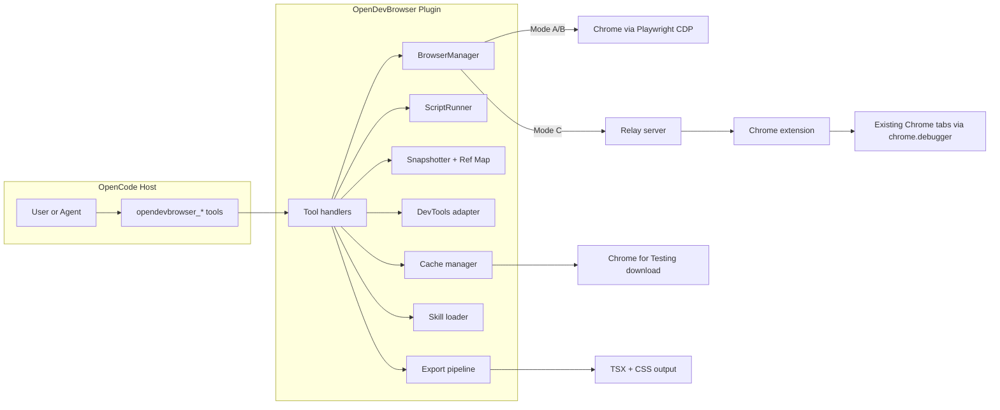
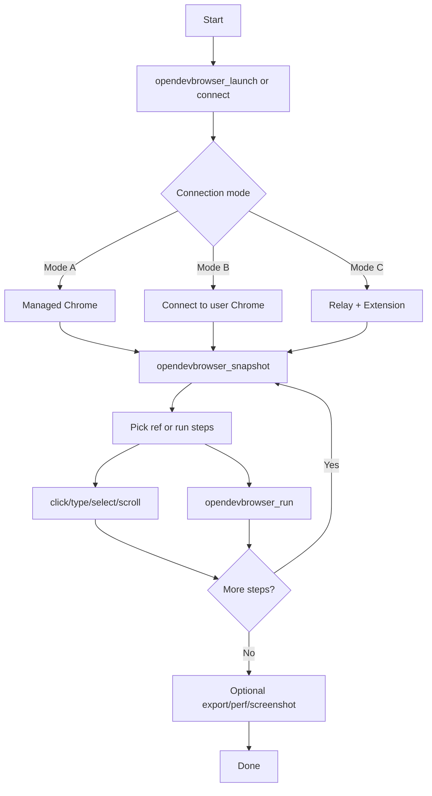

# Architecture Comparison (Planned vs Current)

## Sources
- docs/PLAN.md
- docs/opendevbrowser-plan.md
- docs/IMPLEMENTATION_BLUEPRINT.md

## Planned Architecture (from plan docs)


## Planned Flowchart (script-first loop)


## Current Architecture (from codebase)
```mermaid
flowchart LR
  subgraph Plugin[OpenDevBrowser Plugin (src/)]
    Index[Index plugin entry] --> Config[ConfigStore + resolveConfig]
    Index --> Tools[tools/* createTools]
    Tools --> Manager[BrowserManager]
    Tools --> Runner[ScriptRunner]
    Tools --> RelayServer[RelayServer]
    Tools --> SkillLoader[SkillLoader]
    Tools --> Export[export/* pipeline]

    Manager --> SessionStore[SessionStore]
    Manager --> TargetManager[TargetManager]
    Manager --> RefStore[RefStore]
    Manager --> Snapshotter[Snapshotter]
    Manager --> ConsoleTracker[ConsoleTracker]
    Manager --> NetworkTracker[NetworkTracker]
    Manager --> Cache[cache/*]
    Cache --> ChromeLocator[chrome-locator]
    Cache --> Downloader[downloader]
  end

  Manager --> Playwright[playwright-core]
  Playwright --> Chrome[Chrome (managed or connected)]
  RelayServer --> Ext[extension/]
  Ext --> ConnectionManager[ConnectionManager]
  ConnectionManager --> TabManager[TabManager]
  ConnectionManager --> CDPRouter[CDPRouter -> chrome.debugger]
  ConnectionManager --> RelayClient[RelayClient -> relay]
  Export --> DomCapture[dom-capture]
  DomCapture --> CssExtract[css-extract]
  CssExtract --> ReactEmitter[react-emitter]
  SkillLoader --> SkillPack[skills/opendevbrowser-best-practices/SKILL.md]
```

## Status (Aligned to Plan)
- Snapshot source now uses Accessibility domain AX tree; DOM mutation for refs removed.
- Ref strategy now stores backendNodeId + frameId and invalidates on navigation.
- ScriptRunner includes retry/backoff helpers for transient action/wait failures.
- Extension relay port is configurable via popup storage; defaults to 8787.
- Prompting guide respects the `topic` argument via section filtering.
- CDP endpoint validation uses proper URL hostname parsing (not substring checks).
- Config now reads from plugin-owned file (`~/.config/opencode/opendevbrowser.jsonc`).
- DevTools output (network/console) redacts sensitive data by default.
- Export/clone pipeline sanitizes HTML (strips scripts, event handlers, dangerous URLs).
- Snapshot prefers stable selectors (data-testid, aria-label) and filters to main frame.

## Remaining Gaps
- None. All gaps from ARCHITECTURE_GAPS_REPORT.md have been remediated.

## Recommendations
- Keep plan docs and implementation in sync when new gaps arise.
- Review REMEDIATION_PLAN.md for implementation details of each fix.
