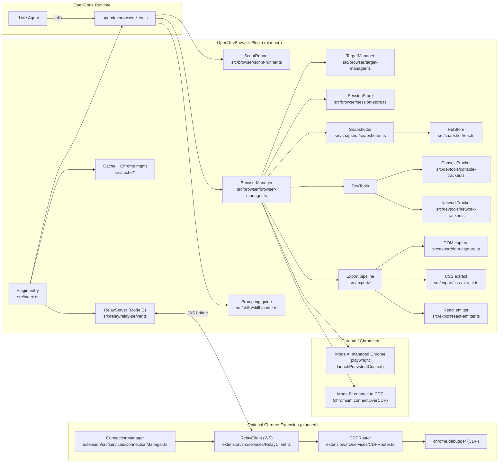
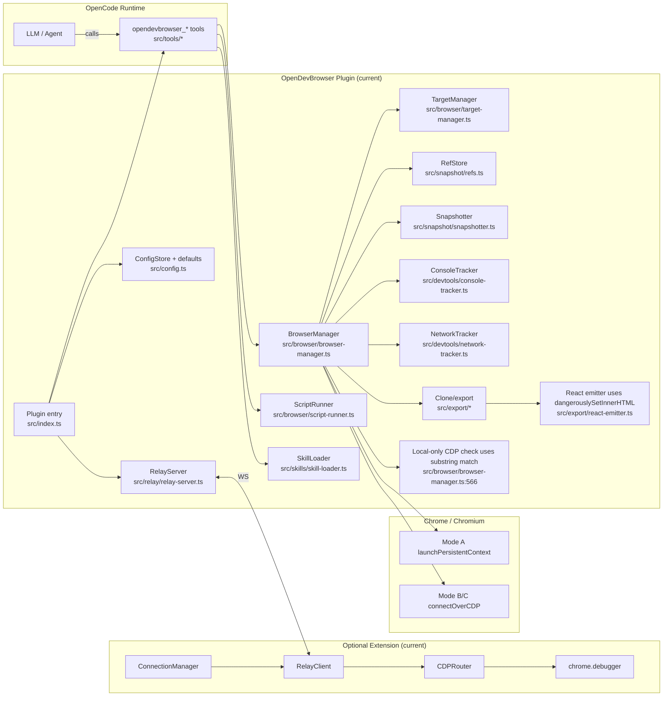
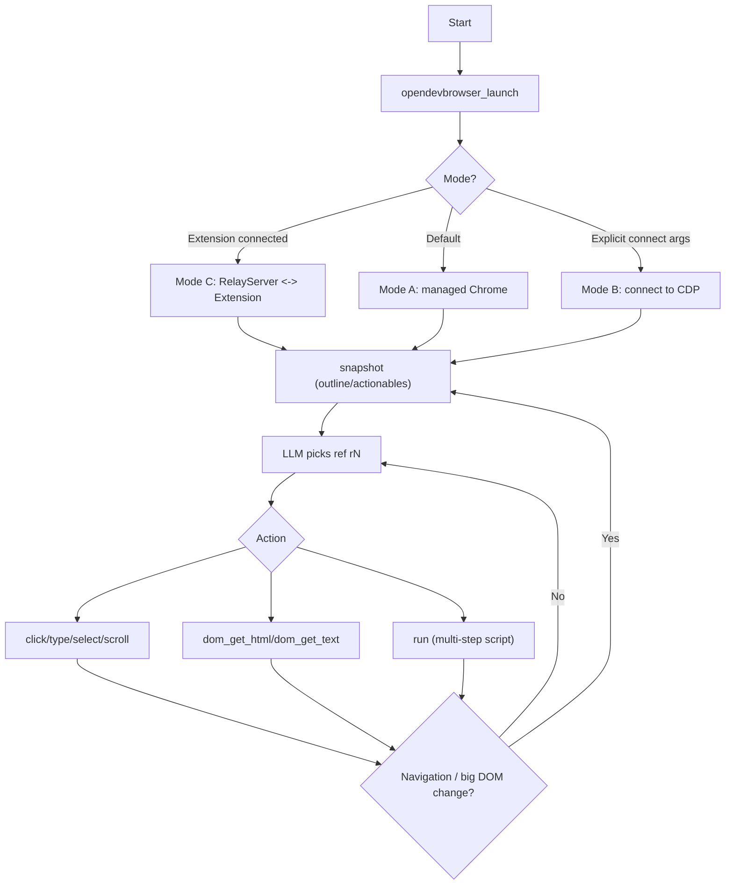

# Architecture Gaps Report: Planned vs Implemented

**Generated**: 2025-12-27  
**Status**: Approved for implementation

---

## Executive Summary

This report compares the originally planned architecture (from `PLAN.md`, `opendevbrowser-plan.md`, `IMPLEMENTATION_BLUEPRINT.md`) against the current implementation. Six critical-to-medium gaps were identified that impact security, UX simplicity, and OpenCode compliance.

**Approved Direction**:
- Config: Global plugin-owned file (`~/.config/opencode/opendevbrowser.jsonc`)
- Export: Sanitized HTML approach (not JSON→TSX)

---

## 1. Planned Architecture



### Planned Security Posture
- CDP endpoints localhost-only by default (strict validation)
- Secrets redacted in snapshots/logs
- No unsafe HTML injection in export pipeline

### Planned UX
- Zero-config out-of-box (sensible defaults)
- Simple plugin installation via OpenCode `plugin` array
- Optional config in plugin-owned file (not polluting OpenCode schema)

---

## 2. Current Architecture



---

## 3. Script-First UX Flowchart



---

## 4. Identified Gaps

| ID | Severity | Gap | Impact |
|----|----------|-----|--------|
| GAP-1 | Critical | OpenCode config schema mismatch | Plugin config keys rejected by OpenCode strict schema validation |
| GAP-2 | Critical | CDP local-only check uses substring match | Security bypass possible (e.g., `127.0.0.1.evil.com`) |
| GAP-3 | High | Export uses `dangerouslySetInnerHTML` unsanitized | XSS gadgets can ship into user apps |
| GAP-4 | High | Network/console polling leaks secrets | Tokens/cookies exposed in tool output |
| GAP-5 | Medium | Empty catch block in snapshotter | Violates repo coding standards |
| GAP-6 | Medium | Refs brittle (nth-child) + frameId unused | Actions fail on iframes; selectors break on DOM changes |
| GAP-7 | Docs | Architecture comparison doc claims "no gaps" | Misleading; gaps exist |

---

## 5. Gap Details

### GAP-1: OpenCode Config Schema Mismatch

**Current behavior**: `src/config.ts:45-51` reads from `config.opendevbrowser` or `config.plugins.opendevbrowser`.

**Problem**: OpenCode's config schema (`opencode.ai/config.json`) is strict (`additionalProperties: false`). Custom keys are rejected, breaking "simple installation" promise.

**Evidence**: OpenCode docs state configs are merged but schema-validated; unknown top-level keys fail validation.

### GAP-2: CDP Local-Only Validation Weakness

**Current behavior**: `src/browser/browser-manager.ts:566` uses `endpoint.includes('127.0.0.1') || endpoint.includes('localhost')`.

**Problem**: Substring check is bypassable:
- `ws://127.0.0.1.evil.com/...` → passes check but connects to attacker server
- `ws://localhost@evil.com/...` → passes check

**Security impact**: Attacker-controlled CDP endpoint could exfiltrate session data or inject malicious scripts.

### GAP-3: Export Pipeline Unsafe by Default

**Current behavior**: `src/export/react-emitter.ts:9` generates:
```tsx
<div dangerouslySetInnerHTML={{ __html: capture.html }} />
```

**Problem**: Captured HTML may contain:
- `` → executes in user's app
- `<a href="javascript:evil()">` → XSS on click
- `<script>` tags (though React doesn't execute via innerHTML, event handlers do work)

**Security impact**: Clone/export can ship XSS gadgets into production apps.

### GAP-4: Secret Leakage in DevTools Output

**Current behavior**:
- `src/devtools/network-tracker.ts:32`: stores raw `req.url()` including query params
- `src/devtools/console-tracker.ts:31`: stores raw `msg.text()`

**Problem**: Tool output may contain:
- Auth tokens in URLs: `?token=eyJhbGc...`
- Logged credentials: `console.log("password:", pw)`
- API keys in request URLs

**Security impact**: Secrets exposed to LLM context and potentially logged.

### GAP-5: Empty Catch Block

**Current behavior**: `src/snapshot/snapshotter.ts:46-52` has `catch { url = undefined; }`.

**Problem**: Violates repo rule "Never use empty catch blocks" in `AGENTS.md`.

### GAP-6: Brittle Refs and Unused frameId

**Current behavior**:
- Selector generation in snapshotter prefers `#id` else builds full `:nth-child()` path
- `frameId` stored in RefEntry but never used in action resolution

**Problem**:
- `:nth-child()` paths break on any DOM change (fragile)
- Actions on iframe elements will fail silently
- No data-testid/aria-label heuristics used

### GAP-7: Stale Documentation

**Current behavior**: `docs/ARCHITECTURE_COMPARISON.md` states "Remaining Gaps: None".

**Problem**: Gaps 1-6 exist and are unaddressed in documentation.

---

## 6. Remediation Summary

| Gap | Fix Approach | Complexity |
|-----|--------------|------------|
| GAP-1 | Plugin-owned global config file | Medium |
| GAP-2 | URL hostname parsing + allowlist | Low |
| GAP-3 | Sanitize HTML before export | Medium |
| GAP-4 | Redact URLs/console text | Medium |
| GAP-5 | Add placeholder in catch | Trivial |
| GAP-6 | Filter to main frame; prefer robust selectors | Medium |
| GAP-7 | Update docs with this report | Low |

---

## 7. References

- OpenCode Plugin Docs: https://opencode.ai/docs/plugins
- OpenCode Config Docs: https://opencode.ai/docs/config
- OWASP XSS Prevention: https://cheatsheetseries.owasp.org/cheatsheets/Cross_Site_Scripting_Prevention_Cheat_Sheet.html
- DOMPurify: https://github.com/cure53/DOMPurify
- oh-my-opencode pattern: https://github.com/code-yeongyu/oh-my-opencode
