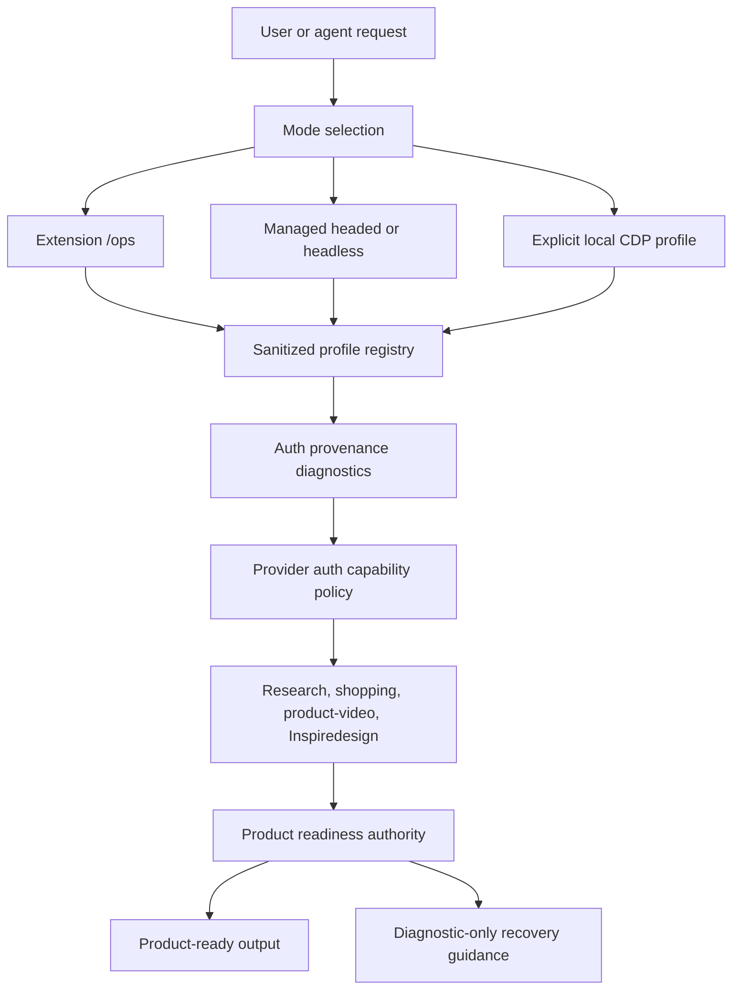
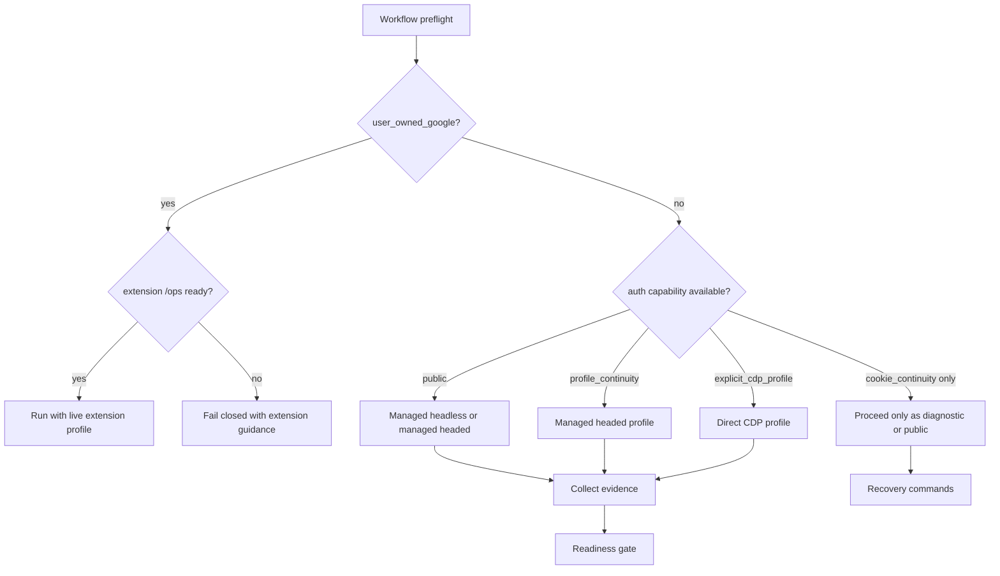

# Non-Extension Session Parity - Plan

## Goal Capsule

| Field | Plan |
|---|---|
| Objective | Make OpenDevBrowser effective without the Chrome extension for workflows that can be safely supported through managed headed profiles, managed headless sessions, and explicit non-default direct CDP profiles. |
| Authority | `docs/investigations/non-extension-session-parity-2026-07-03.md` is the product and research source. Current source code remains authoritative for implementation details. |
| Execution profile | Deep, cross-cutting browser/session, provider, docs, and workflow-readiness work. Implement as small PR-sized phases. |
| Safety stop conditions | Stop if implementation would automate the user's daily default Chrome profile, treat copied cookies as Google auth proof, print secrets or raw profile paths, or weaken Inspiredesign/Pinterest authority. |
| Tail ownership | The implementer owns code, tests, docs/help/installed-skill sync checks, generated public-surface refresh, real workflow evidence, and review-loop cleanup. |

---

## Product Contract

### Summary

OpenDevBrowser should no longer require the Chrome extension for most authenticated or session-sensitive workflows. The extension remains the best path for live active-tab reuse and the only current user-owned Google OAuth path. Non-extension parity is achieved through isolated OpenDevBrowser-owned profiles, explicit local CDP profile attach, provider auth capability routing, and richer sanitized diagnostics.

### Problem Frame

The current extension path gives agents safe access to already-open signed-in Chrome tabs through `/ops`. Managed sessions and direct CDP already share much of the browser-control machinery, but they do not yet have a first-class profile ownership model, provider auth capability contract, or direct CDP target ownership graph. This causes agents to default to extension mode for login-required workflows, and it can produce transport-successful but product-unsuccessful Inspiredesign/Pinterest runs.

### Requirements

**Session Ownership**

- R1. Add a sanitized profile registry that distinguishes extension live tabs, managed persistent profiles, managed temporary profiles, explicit CDP profiles, storage state, and cookie import continuity without exposing raw user paths.
- R2. Make managed headed persistent OpenDevBrowser profiles the default non-extension login path for non-Google-sensitive workflows.
- R3. Keep managed headless for public, fixture, CI, and no-human-login workflows.
- R4. Add an auth-capable direct CDP lane only for explicit non-default local profiles. Raw endpoint attach remains browser-control-only with unknown profile scope and cannot provide auth proof, provider profile capability, or Google user-owned continuity.

**Auth Safety**

- R5. Preserve current `--google-auth-intent user-owned` fail-closed behavior outside extension `/ops`.
- R6. Treat system Chrome cookie bootstrap, explicit cookie import, and provider cookie import as scoped continuity or diagnostics, not login proof.
- R7. Add sanitized auth capability and auth proof diagnostics so agents can decide whether a workflow is auth-capable before starting browser work.
- R8. Do not print cookie values, OAuth tokens, account IDs, private URLs, full user-data paths, or raw profile paths.

**Provider and Workflow Parity**

- R9. Route provider workflows through a typed auth capability contract instead of hard-coded extension-only checks.
- R10. Let Pinterest and other non-Google session-sensitive workflows become product-ready in managed headed or explicit CDP profiles when profile capability and provider evidence are sufficient.
- R11. Preserve Inspiredesign/Pinterest product readiness authority: transport success is not product success, `pin-media-index.json` is the Pinterest pin-media authority, and `media-analysis.json` remains advisory.
- R12. Add CDP target ownership for popup and opener relationships so OAuth/account-chooser recovery can work outside extension relay where technically possible.

**Operator Guidance**

- R13. Update CLI help, docs, generated public-surface manifests, and `opendevbrowser-best-practices` together so novice users get a clear non-extension setup path.
- R14. Add status and session-inspector diagnostics that distinguish extension, managed, headless, CDP, cookie continuity, and provider-verified capability.
- R15. Verify the work with unit tests, mode-matrix integration tests, and real non-extension workflow smokes that inspect product-success authority fields, not just exit codes.
- R16. Preserve mode parity for browser primitives that already work without the extension: target listing, target use, snapshot/ref/action loops, screenshots, screencasts, replay evidence, console traces, network traces, debug traces, and session inspector output.
- R17. Add a challenge-automation capability matrix for `off`, `browser`, and `browser_with_helper` so agents know which modes are safe in extension, managed headed, managed headless, and direct CDP sessions.
- R18. Keep annotation, design canvas, native messaging, `/ops`, relay `/cdp`, and `/canvas` boundaries explicit. Non-extension work may document and diagnose these surfaces, but it must not silently promise parity for extension-hosted UI lanes.
- R19. Include installed skill-pack freshness in novice guidance. The executor must verify the generated docs and installed skill targets do not regress `.agents/skills`, stale package-prefix, or stale `opendevbrowser-best-practices` behavior.

### Scope Boundaries

In scope:

- Profile registry, managed profile UX, explicit local CDP profile launcher or attach lane, provider auth capability routing, target ownership graph, Inspiredesign/Pinterest parity tests, diagnostics, help/docs/skill sync, and workflow verification.
- Cookie import/list provenance, CHIPS/partitioned-cookie diagnostics, provider `--use-cookies` routing, challenge-mode capability, browser primitive mode parity, relay status semantics, and installed skill freshness checks.

Deferred to follow-up work:

- Allowing user-owned Google OAuth through explicit non-default CDP profiles. The current plan keeps it blocked and records this as a policy question.
- Remote CDP beyond localhost. Current security defaults remain local-only.
- Cloud browser profile sync or Browser Use-style cloud profile persistence. This needs a separate privacy and security design.
- Non-extension replacement for extension-hosted design canvas UI. Core canvas APIs remain separate from this session parity plan.
- Replacing extension-local annotation and canvas UI with a new browser-hosted UI. This plan only preserves direct annotation paths, documents the boundary, and prevents status/docs from implying that the extension UI has an equivalent.

Outside this product identity:

- CAPTCHA bypass, stealth automation, Google protection bypasses, silent default Chrome profile automation, broad account/session cloning, or any feature that makes copied cookies appear to be durable Google login state.

### Acceptance Examples

- AE1. Given `--google-auth-intent user-owned`, when the user requests managed, headless, direct CDP, or legacy extension CDP, then OpenDevBrowser fails before browser side effects and points to extension `/ops`.
- AE2. Given `launch --no-extension --profile pinterest-design`, when the browser opens headed and the user logs into Pinterest once, then later Pinterest workflows can use that managed profile as profile-continuity evidence without extension installation.
- AE3. Given `cdp-profile start --profile odb-cdp-smoke`, when the command starts Chrome, then it uses an OpenDevBrowser-owned non-default user data dir and a local remote-debugging endpoint.
- AE4. Given a Pinterest harvest that captures only search-shell or chrome-only pages, when the workflow exits successfully at the transport layer, then product readiness stays `diagnostic_only` and Canvas continuation remains blocked.
- AE5. Given a Pinterest explicit pin in an auth-capable managed profile, when `pin-media-index.json` contains manifest-backed first-party media bytes and ranked references agree, then the run can report `productSuccess=true` with `evidenceAuthority=pin_media_ready`.

---

## Planning Contract

### Key Technical Decisions

- KTD1. Preserve extension `/ops` as the best live active-tab path. It is the only current user-owned Google OAuth route and remains the safest way to reuse a user's daily signed-in Chrome tab.
- KTD2. Build profile registry before broad provider parity. Without a sanitized profile model, providers cannot distinguish isolated ODB profiles from copied cookies or default-profile risk.
- KTD3. Make managed headed persistent ODB profiles the first shippable parity slice. This gives users a dedicated browser to log into once without requiring extension installation or default Chrome automation.
- KTD4. Make direct CDP explicit, local, and registry-allowlisted for auth-capable use. Registry-backed `connect --profile` can be profile-capable; raw `--ws-endpoint` attach stays `profileScope=unknown`, browser-control-only, and blocked from Google user-owned or provider-auth proof.
- KTD5. Separate capability from proof. Cookies can show continuity, declared profiles can allow an auth attempt, provider-specific preflight can mark `provider_verified`, and product readiness still comes only from post-capture authority.
- KTD6. Keep Inspiredesign/Pinterest authority unchanged. Mode parity may produce the evidence, but product readiness still comes from `pin-media-index.json`, ranked references, and readiness gates.
- KTD7. Update public-surface source first. `src/public-surface/source.ts` owns generated help; generated manifests must be regenerated instead of hand-edited.
- KTD8. Treat non-extension parity as a mode matrix, not only an auth feature. Browser primitives, challenge modes, replay/debug evidence, annotation, canvas, native messaging, and relay status each need an owner: implement, verify existing parity, document extension-only status, or defer explicitly.
- KTD9. Treat skill distribution as part of agent readiness. If installed skills are stale or synced to the wrong target family, agents will keep choosing extension-first flows even after code supports safer non-extension profiles.

### High-Level Technical Design

### Existing Implementation To Preserve

- `src/core/auth-intent.ts` already defines and parses `GoogleAuthIntent`.
- `src/browser/browser-manager.ts` already gates `user_owned_google` outside extension mode and already records sanitized auth provenance.
- `src/browser/auth-provenance.ts` already normalizes provider cookie import messages into safe reason codes.
- `src/providers/runtime-policy.ts` already forces extension fallback for `user_owned_google`.
- `src/inspiredesign/product-readiness.ts` already demotes non-authoritative Pinterest output to `diagnostic_only`.
- `src/providers/renderer.ts` already blocks Canvas continuation unless authoritative Inspiredesign evidence is present.

### Safety Seams To Specify During Implementation

- Profile registry storage is process-owned, cache-root-local, and atomically written. Daemon fingerprint mismatch invalidates daemon-backed capability claims until the current daemon is restored, but it does not delete registry records.
- Profile launch ownership is represented by a registry record plus a launch token containing the OpenDevBrowser-created process metadata, local debugging port, and profile id. Cleanup only terminates browsers with a matching live launch token.
- Profile concurrency uses a lease keyed by profile id. The lease stores pid, local port, launch token id, acquired timestamp, and last-seen timestamp; acquire/release are atomic, stale leases are recoverable only after process/port checks fail, and concurrent same-profile launch tests must prove actionable guidance instead of silent reuse.
- Default Chrome profile refusal uses a registry allowlist first, then canonicalized denylist checks from discovered Chrome-family default profile roots. A raw path comparison alone is not sufficient.
- CDP target ownership subscribes to CDP Target-domain lifecycle events such as target created, target info changed, target destroyed, and attach/detach events. Page navigation events may update summaries but must not be the ownership source.
- Pinterest preflight proof is optional and provider-specific. Profile continuity can allow an attempt, but only a safe provider preflight can set `provider_verified`; `pin-media-index.json` remains the post-capture product authority.
- Cookie import/list, provider `--use-cookies`, and system Chrome bootstrap must preserve metadata needed for SameSite, Secure, HttpOnly, partitioned, and CHIPS diagnostics without exposing values.
- Challenge automation support is a capability result, not a request flag echo. `browser_with_helper` is headed-interactive only unless a concrete non-headed helper capability exists.
- Relay status fields stay lane-specific. `/ops` and relay `/cdp` report relay client presence, while direct CDP profile attach reports direct session provenance and endpoint safety.
- Installed skill freshness is checked against the managed target families from `docs/plans/skill-sync-agents-targets-2026-07-02.md`; this plan must not reintroduce stale `.agents/skills` behavior.

### Assumptions

- A missing or unreadable registry record must not block a safe managed or public workflow, but diagnostics must mark profile metadata unavailable.
- The initial direct CDP lane remains localhost-only and refuses default Chrome profile paths.
- Provider auth capability can be additive and does not require replacing all provider policy code in one PR.
- Real Google OAuth validation uses owned test accounts and allowlisted test users only, never personal live Google accounts.

### Dependency Order

| Unit | Depends on | Blocks |
|---|---|---|
| U1 | none | U2, U3, U4, U5, U8, U9 |
| U2 | U1 | U3, U4, U5, U8 |
| U3 | U1, U2 | U4, U5, U6, U8 |
| U4 | U1, U2, U3 | U7, U8 |
| U5 | U1, U2, U3; explicit CDP branch waits for U4 | U6, U8 |
| U6 | U5; explicit CDP branch waits for U4 | U10 |
| U7 | U4 | U8 |
| U8 | U5, U6; target metadata portion also depends on U7 | U10 |
| U9 | U1, U2, U3, U4, U5, U8 | U10 |
| U10 | U1 through U9 | release readiness |

### Inventory Coverage Map

| Inventory surface | Plan owner | Required second-pass treatment |
|---|---|---|
| Cookie bootstrap, cookie import/list, CHIPS, partitioned cookies, and provider `--use-cookies` | U1, U2, U5, U8, U10 | Test metadata preservation and redaction; never let cookie continuity become auth proof. |
| `research run`, `shopping run`, and `product-video run` | U5, U9, U10 | Verify public/headless and managed-profile paths, with product-video inheriting shopping capability instead of inventing a separate auth model. |
| Challenge automation `off`, `browser`, and `browser_with_helper` | U8, U9, U10 | Add status/help guidance and fixture coverage that distinguishes browser-scoped support from human-visible helper support. |
| Target list/use, named pages, snapshot/ref/action loop, screenshots, screencasts, replay, console, network, and debug traces | U7, U8, U10 | Prove existing managed/CDP parity where it already exists; add fallback work only where extension still has a real reliability advantage. |
| Annotation, design canvas, native messaging, extension pairing, `/ops`, relay `/cdp`, and `/canvas` | U8, U9, U10 | Keep extension-only or extension-preferred lanes explicit; do not block non-extension parity on replacing extension-hosted UI. |
| Installed skill-pack freshness and agent guidance cache drift | U9, U10 | Verify `.agents/skills` target handling from the skill-sync plan and add stale-guidance recovery checks to docs, help, and skills. |

---

## Implementation Units

### U1. Lock The Current Safety Baseline

- **Goal:** Preserve existing Google fail-closed and auth provenance behavior before adding new non-extension capability.
- **Requirements:** R5, R6, R8, AE1
- **Dependencies:** none
- **Files:** `src/core/auth-intent.ts`, `src/browser/browser-manager.ts`, `src/browser/ops-browser-manager.ts`, `src/cli/commands/session/launch.ts`, `src/cli/commands/session/connect.ts`, `src/cli/daemon-commands.ts`, `tests/browser-manager.test.ts`, `tests/cli-launch.test.ts`, `tests/cli-session-connect.test.ts`
- **Approach:** Add characterization tests around the existing guard matrix before changing profile or provider code. Keep `GoogleAuthIntent` values unchanged. Any new mode or capability field must still flow through the same fail-closed checks.
- **Patterns to follow:** Existing auth intent parser and browser manager fail-closed tests; existing daemon duplicate preflight guards for clearer CLI errors.
- **Test scenarios:** Managed/headless/direct-CDP/legacy-CDP requests with `user_owned_google` fail before browser side effects. Extension `/ops` remains accepted when ready. Omitted auth intent preserves current managed and provider behavior.
- **Verification:** Focused CLI and browser-manager tests show the safety baseline is unchanged before and after new profile fields land.

### U2. Add Sanitized Session Profile Registry

- **Goal:** Add a first-class profile ownership model that agents and provider policy can trust without leaking secrets.
- **Requirements:** R1, R7, R8
- **Dependencies:** U1
- **Files:** `src/browser/session-profile-registry.ts` (new), `src/cache/paths.ts`, `src/browser/manager-types.ts`, `src/browser/browser-manager.ts`, `src/browser/auth-provenance.ts`, `tests/browser-manager.test.ts`
- **Approach:** Store additive registry records under the OpenDevBrowser cache root with profile kind, profile scope, browser family, safe capability flags, timestamps, optional path hash, and profile lease metadata. Do not store raw profile paths in user-facing diagnostics. Classify extension live, managed persistent, managed temporary, explicit CDP profile, raw CDP unknown profile, storage state, and cookie import.
- **Technical design:** Use process-owned registry files under the cache root with atomic writes and profile leases keyed by profile id. Include pid, port, launch token id, acquired timestamp, and last-seen timestamp in lease metadata. A stale daemon fingerprint suppresses daemon-backed capability claims until preflight is current, but registry records remain readable for non-daemon inspection.
- **Patterns to follow:** Atomic config/cache writes already used by project utilities; sanitized provider-cookie diagnostics in `src/browser/auth-provenance.ts`; cache path ownership in `src/cache/paths.ts`.
- **Test scenarios:** Managed persistent launch creates a registry record and lease. Temporary launch creates a temporary record. Extension `/ops` reports live-extension profile without path metadata. Malformed registry data surfaces sanitized warning and does not leak paths. Stale lease recovery requires failed process and port checks.
- **Verification:** Tests assert no home-directory prefixes, emails, cookie names, account IDs, or full profile paths appear in diagnostics.

### U3. Make Managed Headed Profiles The Default Non-Extension Login Path

- **Goal:** Give novice users a hands-off non-extension login path through dedicated OpenDevBrowser profiles.
- **Requirements:** R2, R3, R7, R13, AE2
- **Dependencies:** U1, U2
- **Files:** `src/browser/browser-manager.ts`, `src/cache/paths.ts`, `src/cli/daemon-commands.ts`, `src/cli/commands/session/launch.ts`, `src/public-surface/source.ts`, `tests/browser-manager.test.ts`, `tests/cli-launch.test.ts`, `tests/cli-help-parity.test.ts`
- **Approach:** Classify headed persistent managed launches as `managed_persistent` and temporary/headless launches as `managed_temporary`. Improve profile-lock guidance to recommend unique ODB profiles or temporary profiles. Keep headless guidance focused on public and CI workflows.
- **Patterns to follow:** Existing `launch --profile` and `persistProfile` behavior; existing profile-lock error wrapping in browser manager and daemon command surfaces.
- **Test scenarios:** Named managed headed profile persists registry metadata. `--persist-profile false` produces temporary profile diagnostics. Concurrent same-profile launch fails through the profile lease and returns actionable lock guidance. Headless output does not claim human-login capability.
- **Verification:** Launch parser, browser-manager, and help parity tests pass with new profile messaging.

### U4. Add Explicit Local CDP Profile Launcher And Attach

- **Goal:** Provide an extensionless live-session path for users who start or attach to a safe non-default profile.
- **Requirements:** R4, R5, R7, R8, AE3
- **Dependencies:** U1, U2, U3
- **Files:** `src/cli/commands/session/cdp-profile.ts` (new), `src/cli/index.ts`, `src/cli/args.ts`, `src/cli/commands/session/connect.ts`, `src/cli/daemon-commands.ts`, `src/browser/browser-manager.ts`, `src/browser/session-profile-registry.ts`, `src/public-surface/source.ts`, `tests/cli-session-connect.test.ts`, `tests/browser-manager.test.ts`, `tests/cli-help-parity.test.ts`
- **Approach:** Add a small command family for starting Chrome with an OpenDevBrowser-owned non-default user data dir and a local remote-debugging endpoint. Let `connect --profile <name>` attach only to registry-backed explicit CDP profiles. Keep raw endpoint attach for current advanced users as browser-control-only with `profileScope=unknown`; block it from provider profile continuity, provider verification, and Google user-owned continuity.
- **Technical design:** Use registry allowlisting plus launch tokens for safety. The launch token records profile id, process id, local port, and ownership nonce. Cleanup only closes a browser when the live token matches; user-started Chrome attached through an endpoint is never closed by OpenDevBrowser.
- **Patterns to follow:** Existing local endpoint validation in browser manager; daemon launch/connect routing; cache path resolution for named profiles.
- **Test scenarios:** Default Chrome profile path is refused through allowlist and canonicalized denylist checks. Non-local CDP endpoint remains blocked unless explicit unsafe config already allows it. `user_owned_google` remains blocked for direct CDP. Raw endpoint attach records unknown profile scope and cannot satisfy provider auth capability. OpenDevBrowser-started CDP browser is cleaned up only when the launch token proves ownership.
- **Verification:** CLI parser and daemon routing tests prove safe profile launch, attach, disconnect, and cleanup boundaries.

### U5. Add Provider Auth Capability Contract

- **Goal:** Replace extension-biased provider auth checks with typed capability and proof routing.
- **Requirements:** R6, R7, R9, R10
- **Dependencies:** U1, U2, U3
- **Files:** `src/providers/types.ts`, `src/providers/runtime-policy.ts`, `src/providers/browser-native-discovery.ts`, `src/browser/manager-types.ts`, `tests/providers-runtime-policy.test.ts`, `tests/providers-contracts.test.ts`, `tests/pinterest-guidance-recipe.test.ts`
- **Approach:** Add provider-level `authCapability`, `authProof`, `googleSensitiveRisk`, `recommendedMode`, and `doNotProceedIf` fields. Map extension live tabs, managed profile continuity, cookie continuity, public mode, and blocked mode first. Add a CDP-specific subsection that only activates after U4 and only for registry-backed explicit CDP profiles. Keep raw CDP endpoint attach browser-control-only and keep `user_owned_google` extension-only.
- **Patterns to follow:** Existing `resolveProviderRuntimePolicy()` fallback mode resolution; current reason-code style in provider types; sanitized browser auth provenance.
- **Test scenarios:** Public research can choose managed/headless. Non-Google login-required provider recommends managed headed profile. Cookie import is continuity only. Provider preflight can upgrade proof to `provider_verified`; declared profile continuity alone cannot. Registry-backed explicit CDP can appear only after U4. Raw endpoint CDP cannot become provider-auth capable. Google user-owned forces extension and fails closed elsewhere. Auth-required provider without capability returns actionable recovery commands.
- **Verification:** Provider policy matrix tests cover each capability and failure mode.

### U6. Make Pinterest And Inspiredesign Use Capability Without Weakening Authority

- **Goal:** Let Pinterest harvests become product-ready in managed headed or explicit CDP profiles when evidence is authoritative.
- **Requirements:** R10, R11, R15, AE4, AE5
- **Dependencies:** U5
- **Files:** `src/providers/browser-native-discovery.ts`, `src/guidance/recipes/pinterest.ts`, `src/inspiredesign/product-readiness.ts`, `src/providers/renderer.ts`, `tests/providers-inspiredesign-workflow.test.ts`, `tests/inspiredesign-product-readiness.test.ts`, `tests/pinterest-guidance-recipe.test.ts`
- **Approach:** Replace the current authenticated-browser check with provider auth capability. Accept live extension or managed profile continuity for an attempt, and mark stronger proof only after a safe Pinterest-specific preflight observes authenticated page state without exposing account data. Add explicit CDP profile continuity only after U4 and only for registry-backed CDP profiles. Do not accept raw cookie observability or raw CDP endpoint attach as proof. Leave product readiness and renderer gates strict.
- **Patterns to follow:** Existing Pinterest recipe authority fields; existing product-readiness demotion rules; existing renderer Canvas continuation gate.
- **Test scenarios:** Managed profile with provider preflight plus authoritative pin media can become `pin_media_ready`. Managed profile without preflight can attempt capture but remains product-ready only if post-capture authority passes. Explicit CDP Pinterest capability is absent until U4. Search-shell/no-media output remains `diagnostic_only`. `media-analysis.json` never grants readiness. Canvas continuation remains blocked when authority fields disagree.
- **Verification:** Inspiredesign workflow tests inspect `productSuccess`, `artifactAuthority`, `evidenceAuthority`, `ranked-references.json`, and `pin-media-index.json`.

### U7. Add CDP Target Ownership For Popups And Account Choosers

- **Goal:** Bring direct CDP closer to extension `/ops` for popup, opener, and OAuth recovery flows.
- **Requirements:** R12, R14
- **Dependencies:** U4
- **Files:** `src/browser/cdp-target-ownership.ts` (new), `src/browser/target-manager.ts`, `src/browser/browser-manager.ts`, `src/browser/manager-types.ts`, `src/browser/session-inspector.ts`, `tests/browser-manager.test.ts`
- **Approach:** Add an auxiliary CDP Target-domain graph that records target id, opener id, corresponding ODB target id, lifecycle state, safe URL summary, and optional popup kind. Populate ownership from Target-domain lifecycle events, then reconcile to `TargetManager` pages by target identity where available and conservative URL/title summaries only as fallback. Keep `TargetManager` as the canonical page registry. Degrade to existing target list behavior when CDP graph data is unavailable or divergent.
- **Patterns to follow:** Current target list/use APIs; extension target session map concept without coupling to extension internals.
- **Test scenarios:** Synthetic OAuth popup records opener relationship. `targets-list --include-urls` exposes safe opener metadata. `target-use` can switch to popup target. Closed popup removes graph entry. Missing graph data does not break managed/headless target operations.
- **Verification:** Target manager and browser-manager tests cover popup graph and no-graph degradation.

### U8. Add Status, Inspector, And Evidence Parity

- **Goal:** Let agents know which non-extension lanes are safe before and during workflow execution.
- **Requirements:** R7, R13, R14, R16, R17, R18
- **Dependencies:** U5 and U6 for profile/status parity; U7 only for target-ownership metadata
- **Files:** `src/browser/session-inspector.ts`, `src/cli/commands/status-capabilities.ts`, `src/cli/daemon-commands.ts`, `src/browser/session-profile-registry.ts`, `src/browser/manager-types.ts`, `src/browser/screencast-recorder.ts`, `src/challenges/capability-matrix.ts`, `src/public-surface/source.ts`, `tests/cli-review-surfaces.test.ts`, `tests/cli-help-parity.test.ts`, `tests/cli-session-inspector.test.ts`, `tests/cli-screencast.test.ts`, `tests/browser-screencast-recorder.test.ts`, `tests/challenges-capability-matrix.test.ts`
- **Approach:** Add sanitized status and inspector fields for profile capabilities, cookie bootstrap policy, auth capability, auth proof, browser primitive support, challenge-mode eligibility, and Google-sensitive risk first. Add CDP endpoint and popup ownership metadata only when U4 and U7 are present. Keep relay `/ops`, relay `/cdp`, direct CDP, annotation, canvas, and native messaging statuses distinct.
- **Patterns to follow:** Existing session inspector summary shape; existing status-capabilities host diagnostics; existing challenge capability matrix tests; existing screencast and session-inspector tests; docs drift tests.
- **Test scenarios:** Status reports managed headed, managed headless, extension, and later explicit CDP capabilities. Inspector reports session profile kind and auth proof without paths. Relay status is not confused with direct CDP status. Challenge mode output distinguishes `off`, browser-scoped automation, and headed helper eligibility. Screencast/replay/debug capability fields do not expose private URLs.
- **Verification:** CLI review surface tests assert exact keys and redaction.

### U9. Sync CLI Help, Docs, Generated Manifests, And Skills

- **Goal:** Make the installation and next-step guidance novice-safe and consistent across public surfaces.
- **Requirements:** R13, R14, R15, R18, R19
- **Dependencies:** U1, U2, U3, U4, U5, U8
- **Files:** `README.md`, `docs/CLI.md`, `docs/SURFACE_REFERENCE.md`, `docs/ARCHITECTURE.md`, `docs/TROUBLESHOOTING.md`, `docs/FIRST_RUN_ONBOARDING.md`, `src/public-surface/source.ts`, `src/public-surface/generated-manifest.ts`, `src/public-surface/generated-manifest.json`, `src/cli/utils/skills.ts`, `src/skills/skill-loader.ts`, `skills/opendevbrowser-best-practices/SKILL.md`, `tests/cli-help-parity.test.ts`, `tests/cli-skills-installer.test.ts`, `tests/postinstall-skill-sync.test.ts`, `tests/skill-loader.test.ts`
- **Approach:** Update `src/public-surface/source.ts` first, regenerate generated manifests, then sync README, CLI docs, architecture docs, troubleshooting, onboarding, and the best-practices skill. Add a non-extension auth/profile decision table, managed-profile quickstart, challenge-mode support matrix, extension-only boundary table, and stale-skill recovery guidance. Preserve the `.agents/skills` target behavior from `docs/plans/skill-sync-agents-targets-2026-07-02.md`.
- **Patterns to follow:** `docs/AGENTS.md` sync rules; existing generated public-surface workflow; skill-sync plan target-family coverage; existing skill installer and loader tests.
- **Test scenarios:** Help examples include public/headless, managed headed profile, extension user-owned Google, and explicit CDP profile. Skill guidance no longer defaults agents to extension when managed profile is safer. Docs still warn that cookie continuity is not Google auth proof. Install/update guidance names `.agents/skills`, managed markers, `command -v`, `which -a`, and `npm prefix -g` checks. Annotation, canvas, native messaging, and extension pairing are not described as solved by non-extension profiles.
- **Verification:** Public-surface generation, docs drift check, help parity tests, skill installer tests, loader tests, postinstall skill sync tests, and skill validator pass.

### U10. Verify Real Workflows And Review Loops

- **Goal:** Prove transport parity and product readiness with real workflow evidence, then close review findings.
- **Requirements:** R15, R16, R17, R18, R19, AE1, AE2, AE3, AE4, AE5
- **Dependencies:** U1 through U9
- **Files:** `.omo/evidence/non-extension-session-parity/**` (ignored evidence), focused test files listed in U1 through U9
- **Approach:** Run focused tests as units land, then run real workflow smokes after all mode plumbing is available. Inspect saved artifacts directly. Treat exit code `0` as transport only until product fields prove readiness. Include workflow proof for public research, shopping/product-video inheritance, challenge-mode diagnostics, status/inspector redaction, and installed skill freshness in addition to Pinterest authority.
- **Patterns to follow:** Existing managed headless smoke evidence in `.omo/ulw-research/20260703-183942-non-extension-session-parity/`; existing Inspiredesign readiness inspection practice.
- **Test scenarios:** Managed headless public smoke captures target list and screenshot. Managed headed profile persists across launches. Profile lock guidance is actionable. Explicit CDP profile attach captures screenshot and debug trace. Synthetic popup fixture recovers opener. Public `research run` works in managed/headless mode. Shopping and product-video do not claim cookie auth proof without provider verification. Challenge `off`, `browser`, and `browser_with_helper` report correct capability. Annotation/canvas/native/relay status checks preserve extension-only boundaries. Pinterest explicit pin with test or owned profile produces `pin_media_ready` when credentials are available. If test credentials are unavailable, fixture-backed authority tests must pass and release notes must state that live Pinterest product-ready proof is blocked, not passed.
- **Verification:** Evidence bundle includes command output, sanitized status, artifact paths, parsed authority fields, and review-loop receipts.

---

## Verification Contract

| Gate | Applies to | Done signal |
|---|---|---|
| Focused unit tests | Each implementation unit | Unit-specific tests pass before broader gates. |
| Typecheck | All TypeScript changes | `npm run typecheck` passes. |
| Lint | Source, tests, docs scripts touched by implementation | `npm run lint` or targeted package lint passes with zero warnings. |
| Full test coverage | Final branch before PR | `npm run test` passes and coverage remains at or above repo threshold. |
| Extension build | Any extension, relay, generated surface, or public-surface impact | `npm run extension:build` passes when relevant. |
| Public surface generation | U8 and U9 | `node scripts/generate-public-surface-manifest.mjs` and `node scripts/docs-drift-check.mjs` pass. |
| Skill validation | U9 | `skills/opendevbrowser-best-practices` validator passes. |
| Real workflow smokes | U10 | Saved evidence shows managed headless, managed headed profile, explicit CDP profile, popup fixture, and Inspiredesign/Pinterest authority outcomes. |

### Real Workflow Evidence Requirements

- Managed headless public smoke must launch with a temporary profile, list the `Example Domain` target, capture a screenshot, and disconnect.
- Managed headed persistent profile smoke must create a named profile, relaunch it, and show registry continuity without extension.
- Explicit CDP profile smoke must start a local non-default profile, attach, list targets, capture screenshot/debug evidence, and disconnect without closing user-owned browsers.
- Provider workflow smoke must include public research plus shopping/product-video capability inheritance and must not treat cookie continuity as provider proof.
- Challenge mode smoke must show mode capability for `off`, `browser`, and `browser_with_helper` without implying challenge bypass.
- Status and inspector smoke must distinguish extension `/ops`, relay `/cdp`, direct CDP, annotation, canvas, native messaging, cookie continuity, and managed profile capability.
- Skill freshness smoke must verify installed guidance or packed-install evidence includes `.agents/skills` markers and stale-skill recovery guidance.
- Pinterest product-ready smoke should use a test or owned Pinterest profile and inspect `pin-media-index.json`, `ranked-references.json`, `productSuccess`, `artifactAuthority`, and `evidenceAuthority`. If credentials are unavailable, fixture-backed authority tests are acceptable for implementation completion, but release readiness must carry an explicit live-smoke blocker instead of claiming product-ready live proof.
- Pinterest diagnostic-only smoke must prove search-shell or no-media output remains blocked from Canvas continuation.

---

## Definition of Done

- All implementation units U1 through U10 are complete in dependency order, with no skipped safety guardrails.
- Google user-owned auth remains extension `/ops` only unless a separate approved policy plan changes it.
- No user-facing output leaks cookie values, tokens, account IDs, private URLs, full profile paths, or full user-data dirs.
- Managed headed profiles are documented as the default non-extension login path.
- Direct CDP profile launch/attach refuses default Chrome profiles and remains localhost-only by default.
- Provider auth capability routing distinguishes public, cookie continuity, profile continuity, live extension, explicit CDP profile, and blocked modes.
- Browser primitive, challenge automation, status, inspector, annotation, canvas, native messaging, and relay semantics have explicit mode support, evidence, or deferral notes.
- Installed skill-pack guidance is verified against managed target-family behavior and does not leave stale `.agents/skills` copies unaddressed.
- Inspiredesign/Pinterest product readiness still depends on manifest-backed authority and not transport success.
- README, docs, generated public surfaces, and skills are synchronized.
- Focused tests, full repo gates, docs drift checks, skill validation, and real workflow evidence pass.
- Abandoned experimental code, stale generated artifacts, and temporary non-evidence scratch files are removed before PR.

---

## Appendix

### Version History

- 2026-07-04: Initial implementation-ready plan from `docs/investigations/non-extension-session-parity-2026-07-03.md`, RepoPrompt seam agents, and builder pass.
- 2026-07-04: Second-pass deepening added inventory coverage for cookies, provider workflows, challenge modes, browser primitives, relay/native/canvas/annotation boundaries, installed skill freshness, and real workflow proof.

### Sources And Research

- `docs/investigations/non-extension-session-parity-2026-07-03.md`
- `docs/plans/google-oauth-session-continuity-2026-06-22.md`
- `docs/plans/inspiredesign-pinterest-capture-fix-2026-07-02.md`
- `docs/plans/skill-sync-agents-targets-2026-07-02.md`
- `docs/reviews/non-extension-session-parity-plan-critique-2026-07-04.md`
- `.omo/ulw-research/20260703-183942-non-extension-session-parity/SYNTHESIS.md`
- `.omo/ulw-research/20260703-183942-non-extension-session-parity/claim-ledger.md`
- `.omo/ulw-research/20260703-183942-non-extension-session-parity/qa-matrix.md`
- Chrome DevTools Protocol Target, Runtime, Page, Network, Storage, Browser, Accessibility, DOM, and Input docs cited by the investigation.
- Playwright persistent context and CDP connection docs cited by the investigation.
- Browser Use local browser, profile, CDP, and cloud profile docs cited by the investigation.
- Google OAuth, Chrome App-Bound Encryption, and DBSC safety sources cited by the investigation.

### Deferred Policy Questions

- Should OpenDevBrowser introduce a new intent distinct from `user_owned_google` for explicit non-default CDP test profiles?
- Should macOS get a small launcher app or script for safe CDP profiles instead of asking novices to copy Chrome flags?
- Should a later plan build a browser-hosted canvas or annotation UI, or should those remain extension-hosted UI paths while core APIs stay non-extension-capable?
- Should remote CDP ever support non-local endpoints beyond existing unsafe opt-in controls?
